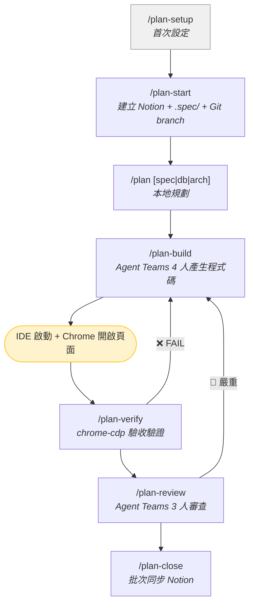

# CREW — Claude Code Plugins

整合 Notion 與 Claude Code 的自訂 Plugin 集合，涵蓋 Bug 處理與功能開發的完整工作流。

## 快速安裝

```bash
# 安裝 Notion MCP Server（提供 Notion 讀寫能力）
claude plugin install Notion

# 加入 Marketplace → 安裝 → 啟用
claude plugin marketplace add mark22013333/crew && \
claude plugin install bug-workflow && \
claude plugin install feature-workflow && \
claude plugin enable bug-workflow && \
claude plugin enable feature-workflow
```

安裝完成後**重啟 Claude Code**，然後在專案目錄下執行 `/bug-setup` 和 `/plan-setup` 進行初始化。

> 可用 `claude plugin list` 確認狀態，確保 Plugin 顯示為 `✔ enabled`。

---

## Plugin 一覽

### Bug Workflow

自動化 Bug 生命週期管理 — 建立、調查、結案、搜尋、復發處理。

| 指令 | 說明 |
|------|------|
| `/bug-setup` | 首次設定引導 |
| `/bug-start <問題簡述>` | 建立 Bug 條目 |
| `/bug-update <內容>` | 更新調查資訊（Log、SQL、判斷） |
| `/bug-update reopen <Bug>` | 重新開啟已結案 Bug |
| `/bug-close` | 結案 + 同步知識庫 |
| `/bug-search <關鍵字>` | 搜尋過往 Bug 解法 |
| `/project-add` | 新增專案到共用專案資料庫 |

詳細說明見 [plugins/bug-workflow/README.md](plugins/bug-workflow/README.md)

### Feature Workflow

功能開發全生命週期管理 — 本地規劃、Agent Teams 產生程式碼與審查、chrome-cdp 驗收驗證、結案同步 Notion。

含 4 個 Opus Agent，在規格、DB、架構、程式碼產生階段提供專家級輸出。



| 指令 | 說明 | Notion 呼叫 |
|------|------|-------------|
| `/plan-setup` | 首次設定引導（Notion 偵測 + Agent 安裝） | 一次性 |
| `/plan-stack` | 偵測專案分層結構，建立自訂技術棧 | **0 次** |
| `/plan-start <任務簡述>` | 建立 Notion 條目 + `.spec/` 目錄 + Git branch | **2-3 次** |
| `/plan [spec\|db\|arch]` | 本地規劃（Feature: spec/db/arch，Bug: investigate/root-cause/fix） | **0 次** |
| `/plan-build [--dry-run]` | Agent Teams 4 人產生程式碼 | **0 次** |
| `/plan-verify [--api-only]` | chrome-cdp 操作瀏覽器驗證驗收條件 | **0 次** |
| `/plan-review [--quick]` | Agent Teams 3 人審查（邏輯/品質/安全） | **0 次** |
| `/plan-close` | 一次性批次同步到 Notion + 知識庫 + Git 提交 | **3-5 次** |
| `/plan-sync` | 手動中途同步（按需） | **2-3 次** |
| `/plan-status` | 列出所有活躍任務 | **0 次** |

詳細說明見 [plugins/feature-workflow/README.md](plugins/feature-workflow/README.md)

---

## 前置條件

1. **Claude Code** — <a href="https://docs.anthropic.com/en/docs/claude-code" target="_blank">安裝指南</a>
2. **Node.js 22+** — `/plan-verify` 的 chrome-cdp 需要（其他指令不需要）
3. **Chrome Remote Debugging** — `/plan-verify` 需要（其他指令不需要）
4. **Notion Workspace** — 需有以下資料庫（或由 setup 引導建立）：
   - **任務追蹤工具**：Bug / 功能 生命週期管理（兩個 Plugin 共用）
   - **專案資料庫**：管理專案對應（兩個 Plugin 共用）
   - **Bug 知識庫**（選用）：Bug 精簡索引
   - **功能設計庫**（選用）：設計文件索引

### Chrome Remote Debugging 設定

`/plan-verify` 透過 Chrome DevTools Protocol 連接已開啟的 Chrome，直接操作已登入的 session 驗證驗收條件。

1. Chrome 網址列輸入 `chrome://inspect/#remote-debugging`
2. 開啟「Remote debugging」切換開關

> 也支援 Chromium、Brave、Edge、Vivaldi。

---

## 首次設定

### Step 1：安裝 Notion MCP Server

```bash
claude plugin install Notion
```

安裝後**重啟 Claude Code**，首次使用 Notion 工具時會自動開啟瀏覽器進行 OAuth 授權：

1. 瀏覽器彈出 Notion 授權頁面
2. 選擇要授權的 Workspace
3. 點擊「允許存取」
4. 授權完成後回到 Claude Code

> 每位使用者需各自完成 OAuth 授權，授權範圍僅限自己選擇的 Workspace。

### Step 2：安裝並啟用 Workflow Plugin

```bash
claude plugin marketplace add mark22013333/crew && \
claude plugin install bug-workflow && \
claude plugin install feature-workflow && \
claude plugin enable bug-workflow && \
claude plugin enable feature-workflow
```

啟用後**重啟 Claude Code**。

### 更新 Plugin

```bash
claude plugin update bug-workflow@company-marketplace && \
claude plugin update feature-workflow@company-marketplace
```

更新完成後**重啟 Claude Code** 使新版生效。

> 若 `update` 顯示已是最新但功能未生效，可先移除再重裝：
> ```bash
> claude plugin uninstall feature-workflow@company-marketplace && \
> claude plugin install feature-workflow@company-marketplace
> ```

### Step 3：執行 Setup 引導

在專案目錄下執行：

```bash
/bug-setup        # 偵測 Notion 資料庫、設定專案對應
/plan-setup       # 自動匯入 bug-workflow 共用 ID + 設定技術棧
```

建議先執行 `/bug-setup`，`/plan-setup` 會自動匯入共用的 Notion ID 和專案路徑。

> Setup 會自動偵測 Workspace 中的資料庫並列出候選讓你選擇，不需要手動輸入任何 ID。

---

## 跨專案支援

Plugin 透過 `git remote get-url origin` 自動偵測 Git Repo 識別碼（如 `FUB03P2402/PushAPIService`），比對設定檔中的「Git Repo」欄位，自動關聯到正確的 Notion 專案。

在不同專案目錄下執行指令，會自動對應不同的 Notion 專案，無需手動切換。

## 設定檔

| 設定檔 | 路徑 | 說明 |
|--------|------|------|
| Bug Workflow | `~/.claude-company/bug-workflow-config.md` | Notion ID、專案對應、欄位對照 |
| Feature Workflow | `~/.claude-company/feature-workflow-config.md` | 同上 + 技術棧定義 |

設定檔儲存位置可在 setup 時選擇公司環境（`~/.claude-company/`）或個人環境（`~/.claude/`）。

## 授權

MIT License
