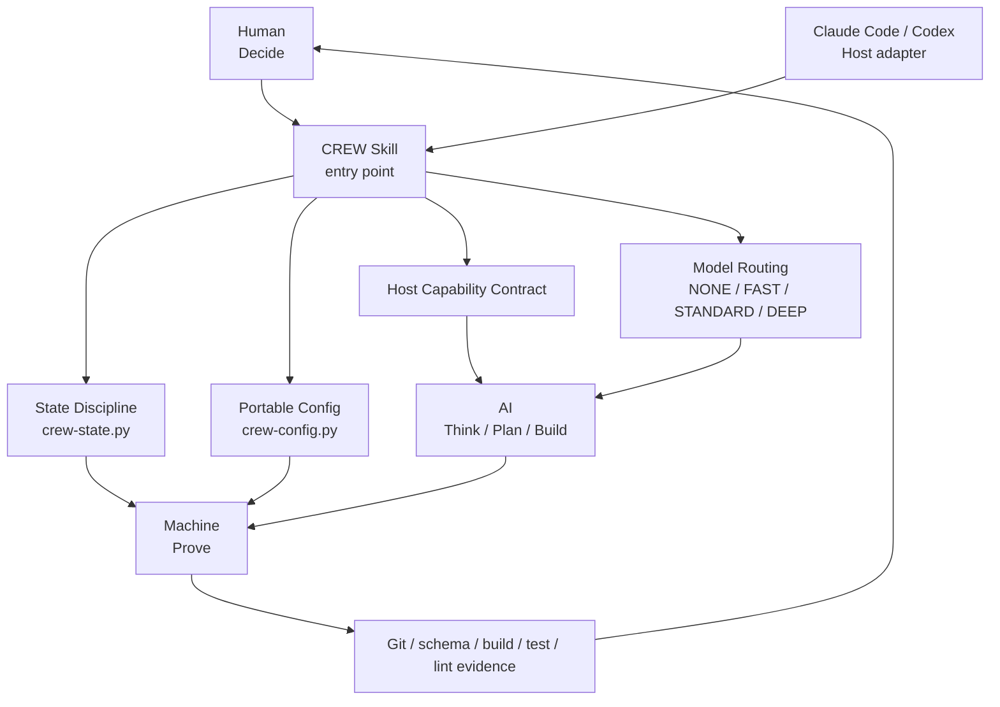
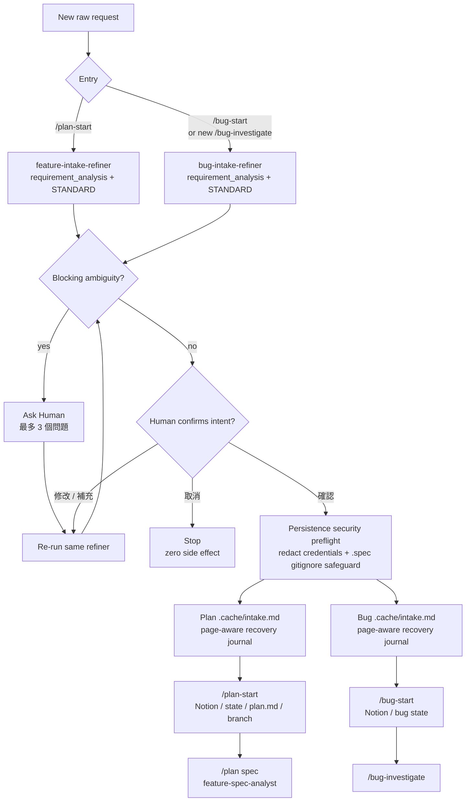
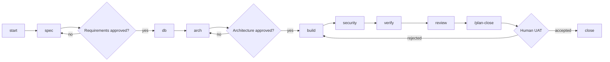
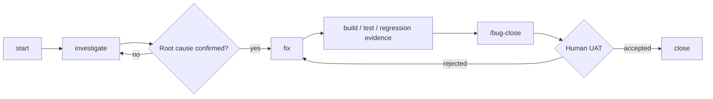
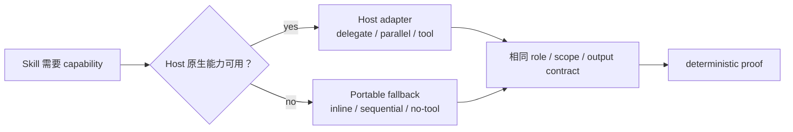

# CREW — Portable AI SDLC Framework

CREW 用 `.spec/`、deterministic state/runtime、可重複 Skill 與 Human approval gates 管理 Bug 修復與功能開發生命週期。CREW 6 的核心 workflow 不綁單一 AI Host：Claude Code 與 Codex 共用同一套流程契約，Host-specific 工具只存在 adapter 邊界。

## 核心心智模型

- **Human = Decide**：需求、架構、UAT 等不可替代的決策由人做。
- **AI = Think / Plan / Build**：分析、規劃、實作與 review 由模型執行。
- **Machine = Prove**：Git、schema、state transition、build/test、lint 等 deterministic 工作交給程式驗證。
- **Skill = entry point，不是 brain**：狀態、路由、設定與 capability contract 由共用 runtime/reference 管理。

### Portable architecture

<!-- crew:diagram portable-architecture -->

```mermaid
flowchart TB
    Human["Human<br/>Decide"] --> Skill["CREW Skill<br/>entry point"]
    Host["Claude Code / Codex<br/>Host adapter"] --> Skill

    Skill --> Capability["Host Capability Contract"]
    Skill --> Routing["Model Routing<br/>NONE / FAST / STANDARD / DEEP"]
    Skill --> State["State Discipline<br/>crew-state.py"]
    Skill --> Config["Portable Config<br/>crew-config.py"]

    Capability --> AI["AI<br/>Think / Plan / Build"]
    Routing --> AI
    State --> Machine["Machine<br/>Prove"]
    Config --> Machine
    AI --> Machine
    Machine --> Evidence["Git / schema / build / test / lint evidence"]
    Evidence --> Human
```

CREW 6 的四個共用 contract：

| Contract | 用途 |
|---|---|
| [Host Capability Contract](plugins/bug-workflow/references/host-capabilities.md) | `project_instructions`、委派、平行/序列 fallback、tool probe、human interaction |
| [Model Policy](plugins/bug-workflow/references/model-policy.md) | Provider-neutral `NONE / FAST / STANDARD / DEEP` profiles 與 write boundary |
| [State Discipline](plugins/bug-workflow/references/state-discipline.md) | Feature/Bug type-aware state、approval gates、單一寫者 |
| [Portable Config Contract](plugins/bug-workflow/references/config-contract.md) | logical config keys、portable root、legacy read fallback |

---

## 快速安裝

### Claude Code

```bash
claude plugin install notion

claude plugin marketplace add mark22013333/crew
claude plugin install bug-workflow
claude plugin install feature-workflow
```

安裝後重啟 Claude Code，再執行 `/crew-init`，或依序執行 `/bug-setup`、`/plan-setup`、`/project-add`。

### Codex

```bash
codex plugin marketplace add mark22013333/crew
codex plugin add bug-workflow@crew
codex plugin add feature-workflow@crew
codex plugin list
```

上述流程已用 Codex CLI 0.158.0 做過真實 marketplace add + plugin install smoke。安裝後兩個 plugin 皆應顯示 `installed, enabled`。

> Claude Code 與 Codex 的工具名稱不同，但 workflow 依賴的是 capability contract。沒有 multi-agent、平行 delegation 或 per-worker model 選擇時，CREW 會降級成 inline / sequential 執行，不會因此破壞流程正確性。

---

## 更新既有 CREW

如果你已經安裝 CREW，**優先使用統一入口**：

```text
/crew-upgrade
/crew-upgrade --check
```

`/crew-upgrade` 由 `bug-workflow` 提供，會依目前 Host 執行對應的公開 plugin CLI；不直接讀寫 Host 私有 cache/registry。更新完成後請開新 session，避免目前 session 仍載入舊 Skill。

如果只安裝 `feature-workflow`、舊版 `/crew-upgrade` 無法使用，或要手動復原，可直接執行 Host-native 指令。

### Claude Code 手動更新

```bash
claude plugin marketplace update company-marketplace
claude plugin update bug-workflow@company-marketplace
claude plugin update feature-workflow@company-marketplace
claude plugin list
```

只更新你已安裝的 plugin；若只裝其中一個，就只執行該行 `plugin update`。

### Codex 手動更新

```bash
codex plugin marketplace upgrade crew
codex plugin list
```

Codex 的 marketplace upgrade 會刷新 Git-backed marketplace snapshot；已設定的 local-marketplace plugin 會隨 refresh 取得新版內容。若 marketplace 尚未註冊，先執行 `codex plugin marketplace add mark22013333/crew`；缺少某個 plugin 時再用 `codex plugin add <plugin>@crew` 安裝。

---

## 首次設定

### 1. 準備專案指令

CREW 需要 `project_instructions`，接受：

- `AGENTS.md`
- `CLAUDE.md`

兩者都存在時都可讀；有實質衝突時會把衝突列為歧義，不自行忽略其中一份。

- Claude Code 可用 `/init` 建立 `CLAUDE.md`。
- Codex 使用既有 `AGENTS.md` 即可，不要求建立 Claude 專屬檔案。

### 2. 建立 CREW 設定

```text
/bug-setup
/plan-setup
```

CREW-owned config 不再由 README 指定某個 Host 目錄。所有 Skill 都透過共享 `plugins/*/scripts/crew-config.py` 與 logical key 存取。

Portable config root 優先序：

1. `CREW_CONFIG_HOME`
2. `$XDG_CONFIG_HOME/crew`
3. `~/.config/crew`

主要 logical keys：

| Key | 內容 |
|---|---|
| `bug/config` | Bug workflow 主設定 / Notion metadata |
| `bug/learning` | Bug learning storage |
| `feature/config` | Feature workflow 主設定 |
| `feature/project` | repo-id → project mapping |
| `feature/stack` | 自訂 stack definition |

Resolver 讀取時可支援既有 legacy fallback；新寫入一律走 canonical portable path。Host marketplace、plugin cache、`settings.json`、rules 等不是 CREW config contract 的一部分。

### 3. 註冊專案

```text
/project-add
/plan-stack   # 只有自訂/非標準 stack 才需要
```

`/project-add` 會以 repo-id 維護 portable `feature/project` 對應；不再把 project mapping 複寫回 Bug/Feature 主設定。

---

## 需求入口：Intake Refinement

新的 Feature / Plan 與 Bug raw request 都會先經 intake refinement；使用者不需要手動呼叫 Refiner。Named Agent 是 workflow 內部執行元件，不是 Slash Skill。

<!-- crew:diagram intake-refinement-flow -->

```mermaid
flowchart TD
    Raw["New raw request"] --> Kind{"Entry"}
    Kind -- "/plan-start" --> FRefiner["feature-intake-refiner<br/>requirement_analysis + STANDARD"]
    Kind -- "/bug-start<br/>or new /bug-investigate" --> BRefiner["bug-intake-refiner<br/>requirement_analysis + STANDARD"]
    FRefiner --> Blocking{"Blocking ambiguity?"}
    BRefiner --> Blocking
    Blocking -- "yes" --> Ask["Ask Human<br/>最多 3 個問題"]
    Ask --> Retry["Re-run same refiner"]
    Retry --> Blocking
    Blocking -- "no" --> Confirm{"Human confirms intent?"}
    Confirm -- "修改 / 補充" --> Retry
    Confirm -- "取消" --> Stop["Stop<br/>zero side effect"]
    Confirm -- "確認" --> Guard["Persistence security preflight<br/>redact credentials + .spec gitignore safeguard"]
    Guard --> PlanCache["Plan .cache/intake.md<br/>page-aware recovery journal"]
    Guard --> BugCache["Bug .cache/intake.md<br/>page-aware recovery journal"]
    PlanCache --> Plan["/plan-start<br/>Notion / state / plan.md / branch"]
    BugCache --> Bug["/bug-start<br/>Notion / bug state"]
    Plan --> Spec["/plan spec<br/>feature-spec-analyst"]
    Bug --> Investigate["/bug-investigate"]
```

共用規則：

- **Feature / Plan** 使用 `feature-intake-refiner`；**Bug** 使用 `bug-intake-refiner`。
- 兩者都只回答「使用者想做什麼／問題是什麼」，不提前產 AC、DB/API/架構、根因或 implementation。
- Human confirmation 是 hard gate；確認前禁止 Notion create/update、`.spec`、state init、Git branch mutation。
- Host 沒有 `delegate_readonly` / named sub-agent 時，主 Agent inline 執行同一份 shared intake contract；**Human confirmation 不能省略**。
- 已存在的 task、`/bug-investigate --resume`、後續 plan/bug lifecycle 不重新 refine。
- Human 確認後、任何 persistence 前做 **security preflight**：疑似 password/token/API key/private key/Cookie 等 credential 必須先請 Human 提供 redacted 版本，不寫進 cache、Notion、plan.md 或 state。
- 在 Git repo 內建立 intake cache/state 前先確認 `.spec/` 已被 `.gitignore` 保護。

Persistence / recovery：

- Feature Notion 保留 `### 原始需求` + `### 確認後任務描述`；`plan.md` 只保存 confirmed refined brief。
- Plan 在 Human confirmation + slug 決定後先建立 `.spec/{slug}/.cache/intake.md` recovery journal，保存 original/refined/title/type 與 `notion_page_id`。Notion page create 成功後先把 page ID 寫回 cache，再進 state init。
- Plan 重跑若遇到 matching cache 且 state 不存在或仍在 `start`，會先詢問是否沿用 pending task；cache 有 page ID 時先 fetch 並沿用，避免 duplicate page/task。
- `/plan-sync` 會先做 cache/page/state reconciliation：page ID 先寫 cache，再由 state writer 綁定，fetch 驗證 intake prefix 後才清 cache；`/plan-close` 遇到 page ID 不一致會 BLOCK，不猜 page。
- Bug Notion 保留 `### 原始通報` + `### 確認後問題描述`；Bug state `name` 使用 confirmed title。
- Bug recovery journal 同樣保存 `notion_page_id`；`/bug-investigate`、`/bug-update`、`/bug-close` 都執行 **Bug intake recovery preflight**。
- Bug cache 只有在重新 fetch 確認兩個 intake headings **以及五個標準 Bug sections（調查過程／根因分析／修復方案／驗證／經驗教訓）**都存在後才刪除。
- CREW 內建 scripts 透過 `CREW_PLUGIN_ROOT` / `plugin_root` capability 解析，不依賴某一家 Host marketplace/cache path。
- Refiner 不是 Slash Skill，所以不會出現在 `/` command list；workflow 會自動使用。

完整 shared contract 見 [Intake Refinement Contract](plugins/bug-workflow/references/intake-refinement.md)。

---

## State、Approval Gate 與斷點續跑

每個 v2 任務的唯一流程狀態是：

```text
.spec/{slug}/state.json
```

唯一寫者是 `scripts/crew-state.py`，Skill 不直接手寫狀態欄位。

### Feature lifecycle

<!-- crew:diagram feature-lifecycle -->

```mermaid
flowchart LR
    Start["start"] --> Spec["spec"]
    Spec --> Req{"Requirements approved?"}
    Req -- "no" --> Spec
    Req -- "yes" --> DB["db"]
    DB --> Arch["arch"]
    Arch --> ArchGate{"Architecture approved?"}
    ArchGate -- "no" --> Arch
    ArchGate -- "yes" --> Build["build"]
    Build --> Security["security"]
    Security --> Verify["verify"]
    Verify --> Review["review"]
    Review --> CloseCmd["/plan-close"]
    CloseCmd --> UAT{"Human UAT"}
    UAT -- "rejected" --> Build
    UAT -- "accepted" --> Closed["close"]
```

Runtime state：`start → spec → db → arch → build → security → verify → review → close`

### Bug lifecycle

<!-- crew:diagram bug-lifecycle -->

```mermaid
flowchart LR
    Start["start"] --> Investigate["investigate"]
    Investigate --> Root{"Root cause confirmed?"}
    Root -- "no" --> Investigate
    Root -- "yes" --> Fix["fix"]
    Fix --> Proof["build / test / regression evidence"]
    Proof --> CloseCmd["/bug-close"]
    CloseCmd --> UAT{"Human UAT"}
    UAT -- "rejected" --> Fix
    UAT -- "accepted" --> Closed["close"]
```

Runtime state：`start → investigate → fix → close`

Bug 的 build/test/回歸證據屬於 `fix` work units，不偽造 Feature 的 verify/review phase。

### Human gates

- Requirements approval：未核准不得進入下游 build。
- Architecture approval：架構未核准不得進入 build。
- UAT：machine verify / review 不能自動等同人類接受；Feature 與 Bug 都要由 Human 明確決定。

`/plan-next` 與 session brief 會從 state 計算下一步；中斷後不需要靠模型回憶流程進度。

---

## Model Routing

Workflow 先選能力 profile，再由 Host adapter 對映實際 provider：

| Profile | 用途 |
|---|---|
| `NONE` | Git、grep、schema validation、build/test 等 deterministic tooling |
| `FAST` | repository search、證據蒐集、log/test output 摘要 |
| `STANDARD` | 一般需求分析、review、debugging |
| `DEEP` | architecture、DB schema、security、performance、複雜根因、高風險正式修改 |

正式產品程式碼只有兩條流程可以修改：

- `/plan-build`
- `/bug-fix`

其他 Skill 只能修改規格、報告、state/metadata 或外部系統紀錄，不能順手改產品碼。

---

## Host Capability 與降級

核心 Skill 描述「需要什麼能力」，不綁產品工具：

| Capability | 正常用途 | Host 缺少能力時 |
|---|---|---|
| `project_instructions` | 讀專案規範 | 沒有任何指令檔才阻擋 |
| `delegate_readonly` | 探索、分析、review | 主 Agent inline 唯讀執行 |
| `delegate_write` | 已核准的正式修改 | 主 Agent 依 allowed scope 執行 |
| `parallel_delegate` | 互不依賴工作平行化 | 退化成 sequential |
| `tool_probe` | 判斷 DB/瀏覽器等外部工具 | 走 no-tool fallback |
| `ask_user` | 取得 Human decision | 一般對話詢問 |

<!-- crew:diagram capability-fallback -->

```mermaid
flowchart LR
    Need["Skill 需要 capability"] --> Probe{"Host 原生能力可用？"}
    Probe -- "yes" --> Native["Host adapter<br/>delegate / parallel / tool"]
    Probe -- "no" --> Fallback["Portable fallback<br/>inline / sequential / no-tool"]
    Native --> Contract["相同 role / scope / output contract"]
    Fallback --> Contract
    Contract --> Proof["deterministic proof"]
```

平行是效能最佳化，不是 workflow correctness 的前置條件。

---

## Bug Workflow

Bug 主流程：

```text
raw issue → /bug-start（refine + Human confirm） → /bug-investigate → /bug-fix → /bug-close
```

| 指令 | 說明 |
|---|---|
| `/bug-setup` | 建立/更新 portable Bug config |
| `/bug-start <問題>` | 自動 Bug Intake Refiner + Human confirm，再建立 Bug + minimal runtime state |
| `/bug-investigate` | 證據蒐集、假說驗證、根因確認，可 resume |
| `/bug-update` | 更新調查資訊或重新開啟 Bug |
| `/bug-fix` | 修復、回歸測試、deterministic 驗證，可 resume |
| `/bug-close` | Human UAT 後結案、同步知識與 merge 引導 |
| `/project-add` | 建立/更新 repo-id 專案對應 |
| `/crew-init` | 首次 setup / registration 偵測與引導 |
| `/crew-doctor` | 環境、config、project registration 健診 |
| `/crew-upgrade` | 更新 CREW plugins |

詳見 [Bug Workflow README](plugins/bug-workflow/README.md)。

---

## Feature Workflow

Feature 主流程：

```text
raw request → /plan-start（refine + Human confirm） → /plan → /plan-build → /plan-security → /plan-verify → /plan-review → /plan-close
```

| 指令 | 說明 |
|---|---|
| `/plan-setup` | 建立/更新 portable Feature config |
| `/plan-stack` | 建立自訂 stack definition |
| `/plan-start <任務>` | 先由 Intake Refiner 潤飾 raw request 並 Human 確認，再建立 Notion + `.spec/` + Git branch |
| `/plan-explore` | 自由探索與方案比較 |
| `/plan-browse` | 深讀/比較既有 `.spec/` |
| `/plan [spec\|db\|arch]` | 三 pass 規劃與 Human approval loop |
| `/plan-build` | 依核准規格產生正式程式碼 |
| `/plan-security` | 安全審查 |
| `/plan-verify` | UAT 前 machine/browser 驗證與 evidence |
| `/plan-review` | 邏輯/品質/效能 review |
| `/plan-close` | Human UAT + 結案同步 |
| `/plan-sync` | 中途同步 Notion |
| `/plan-deploy-confirm` | 部署 SQL step 回報 |
| `/plan-status` | 查看所有任務狀態；v1 可使用 migrate mode |
| `/plan-next` | 由 state 計算下一步 |
| `/plan-drift` | `plan.md` anchor / code drift 檢查 |
| `/plan-demo` | 純本地評估模式 |

詳見 [Feature Workflow README](plugins/feature-workflow/README.md)。

---

## SessionStart hook

Claude Code adapter 安裝 SessionStart hook，會以 `crew-state.py session-brief` 讀取當前 repo 的 `.spec/*/state.json`，顯示未完成工作與下一步。它不修改產品檔案、不需要網路，而且錯誤時不阻擋 session。

其他 Host 若沒有同等 hook lifecycle，不影響 CREW 正確性；直接使用 `/plan-next` 或對應 Skill 即可。

---

## v1 相容與退休

Feature v1 任務目前仍支援。Removal eligibility：

- 第一個 `feature-workflow@5.1.0+` 發布；或
- `2026-10-26`

以先到者為準。門檻到達前不得提前刪除 `legacy-v1.md`、`/plan-status --migrate` 或 v1 偵測入口。

詳見 [legacy-v1.md](plugins/feature-workflow/references/legacy-v1.md)。

---

## 進階文件

| 主題 | 連結 |
|---|---|
| 系統需求 / 前置條件 | [docs/prerequisites.md](docs/prerequisites.md) |
| Windows 指南 | [docs/windows.md](docs/windows.md) |
| DBHub | [docs/dbhub.md](docs/dbhub.md) |
| Architecture Decision Records | [docs/adr/README.md](docs/adr/README.md) |
| Host Capability Contract | [plugins/bug-workflow/references/host-capabilities.md](plugins/bug-workflow/references/host-capabilities.md) |
| Model Policy | [plugins/bug-workflow/references/model-policy.md](plugins/bug-workflow/references/model-policy.md) |
| Portable Config Contract | [plugins/bug-workflow/references/config-contract.md](plugins/bug-workflow/references/config-contract.md) |
| Intake Refinement Contract | [plugins/bug-workflow/references/intake-refinement.md](plugins/bug-workflow/references/intake-refinement.md) |

## 授權

MIT License
