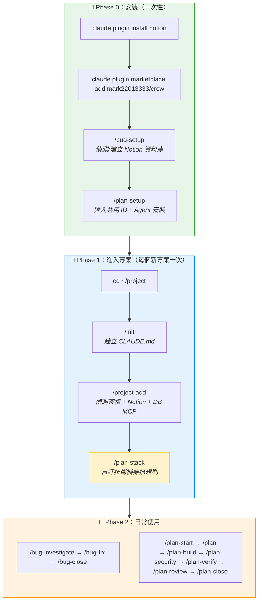
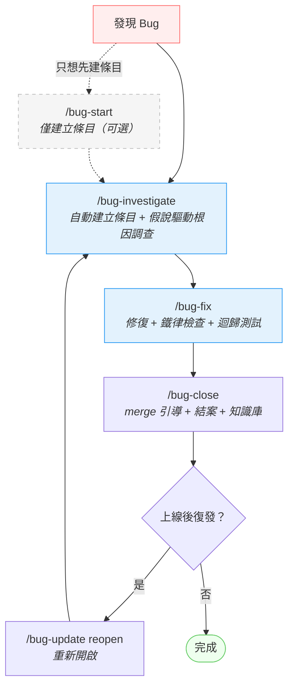
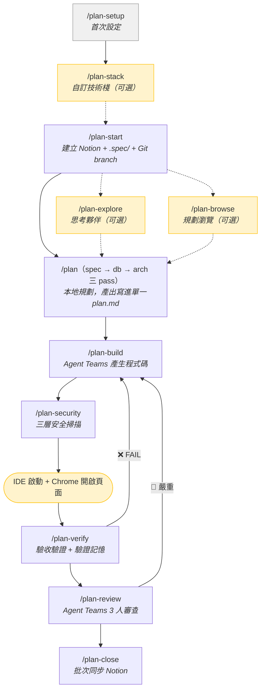
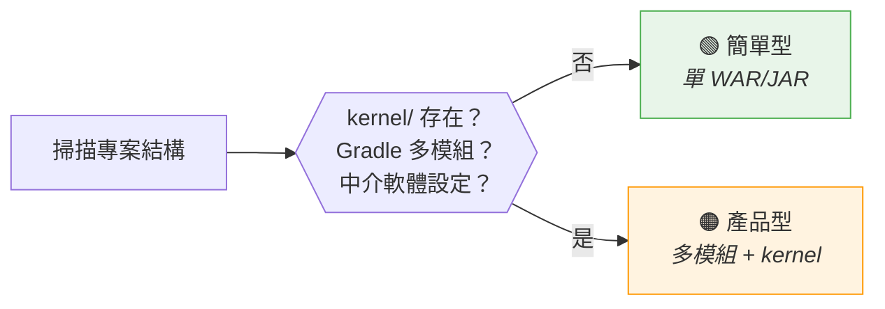

# CREW — AI SDLC Plugins

以 `.spec/`、狀態機與可重複 Skill 管理 Bug 處理與功能開發生命週期。目前 Claude Code 工作流為完整支援路徑；CREW 6.0 起逐步加入 Codex portable plugin 相容層。

## 快速安裝

### Claude Code

```bash
# 安裝 Notion MCP Server（提供 Notion 讀寫能力）
claude plugin install notion

# 加入 Marketplace → 安裝（安裝後自動啟用）
claude plugin marketplace add mark22013333/crew && \
claude plugin install bug-workflow && \
claude plugin install feature-workflow
```

安裝後 Plugin 會自動啟用，**重啟 Claude Code** 後在專案目錄下執行 `/bug-setup` 和 `/plan-setup` 進行初始化。

> 可用 `claude plugin list` 確認狀態，確保 Plugin 顯示為 `✔ enabled`。
> 若未自動啟用：`claude plugin enable bug-workflow && claude plugin enable feature-workflow`

### Codex（CREW 6.0 遷移 Phase 1）

先加入 CREW repo marketplace：

```bash
codex plugin marketplace add mark22013333/crew
codex plugin marketplace list
```

接著啟動 `codex`，輸入 `/plugins`，從 **CREW** marketplace 安裝 `bug-workflow`、`feature-workflow`，安裝後開新 chat/session。

> Phase 1 的目標是讓 Codex 能發現與安裝 CREW portable plugins。現有部分 Skill 仍包含 Claude Code 專屬的 Agent Teams、Agent tool、`CLAUDE.md` 與 `claude mcp` 指令；這些會在後續 Phase 2 抽成 Host Capability Adapter。換句話說，目前「能安裝」已成立，但不宣稱所有 Claude-specific orchestration 已在 Codex 等價執行。

---

## 進階文件

| 主題 | 連結 |
|------|------|
| 完整前置條件與系統需求 | [docs/prerequisites.md](docs/prerequisites.md) |
| Windows 使用者指南 | [docs/windows.md](docs/windows.md) |
| DB MCP（DBHub）設定 | [docs/dbhub.md](docs/dbhub.md) |
| Notion 資料庫架構 ER 圖 | [docs/notion-schema.md](docs/notion-schema.md) |
| 架構決策紀錄（ADR） | [docs/adr/](docs/adr/) |
| 開發與發版指南 | [CONTRIBUTING.md](CONTRIBUTING.md) |

> 💡 環境有問題？跑 `/crew-doctor` 一次性檢查所有依賴並給出修法。

---

## `.spec/` 長什麼樣，為什麼這樣設計

一個任務只有三個檔：

```
.spec/{slug}/
├── plan.md      唯一給人與 LLM 讀的文件（六章節，典型 50–80 行）
├── state.json   流程狀態，機器讀的，唯一寫者是 crew-state.py
└── deploy.sql   唯一 SQL 事實來源，給 DBA 執行
```

### 文件只寫程式碼裡看不到的東西

`plan.md` 六個章節：**目標與範圍**、**驗收條件**、**決策紀錄**、**已知取捨與風險**、**指路**、**檢查報告摘要**。

共同點是「翻程式碼翻不到」：為什麼要做、為什麼選 A 不選 B、當初知道但決定先不處理的坑。
這些不會因為改一行程式就過期。

反過來說，**欄位清單、方法簽章、類別清單、DDL、檔案清單一律不准寫進 `plan.md`**。
這些東西程式碼才是事實，抄一份進文件只會得到兩個結果：Token 變貴，以及一份改天就變成謊話的抄本。
要指涉它們就用錨點：

```markdown
- 鎖定計數改走 Redis（原因：多節點 in-memory 會漏算）
  → `@code:src/main/java/.../LoginAttemptService.java#recordFailure` (L88)
- 表結構見 `@sql:deploy.sql#login_attempt`
```

行號 `(L88)` 寫在錨點外面，是給人看的提示 —— 程式碼上下位移不算漂移。

### 這樣做的代價

錨點自己會失效：檔案改名、符號被刪、程式碼改了但決策沒更新。所以有三道防線：

| 防線 | 做什麼 | 會不會擋你 |
|------|--------|-----------|
| `check-spec-drift.py` | 驗錨點是否還指得到東西（D1–D7 分級） | 不會，它只回報 |
| `/plan-drift` | 機械型（改名、行號位移）自動修；語意型逐條問過你才改 | 不會 |
| `/plan-close` 硬關卡 | 結案前擋在 `git add` 與 Notion 同步**之前** | **會** —— FAIL 擋，WARN 逐筆問過才放行 |

硬關卡只設在結案這一刻，因為此時程式碼已穩定、誤殺最低；而錯過這一刻，漂移的文件會被
原樣推進 Notion 知識庫長期腐爛 —— 把不可信的內容傳播出去，比不同步更糟。

會 FAIL 的只有兩種情況：錨點指的**檔案真的不在**、**符號真的不在檔案裡**。
其餘一律 WARN。這是刻意的 —— 誤報太多會讓人把檢查關掉，那比沒有檢查更糟。

> 完整的設計理由與被否決的方案見 [ADR-006](docs/adr/006-anchors-over-transcription.md)。

### 實測

| 指標 | v4 | v5 |
|------|-----|-----|
| `.spec/` 純文字 | 1893–2385 行 | **186 行** |
| 產出檔數 | 12–17 | **3** |
| `/plan-next` 餵給模型 | 讀多個檔案，再讓模型讀 18 列決策表推理 | **85 bytes** 結構化答案 |
| 漂移偵測 | 2 項單向抽查，WARN 不擋 | 錨點檢查 ＋ 結案硬關卡 |

（`state.json` 111 行看起來不小，但它是機器讀的 —— `/plan-next` 拿到的是 script 算好的答案，不是 JSON 原文。）

---

## 從 v4 升級

`bug-workflow@4.0.0` 與 `feature-workflow@5.0.0` 是 **major 版，含破壞性變更**。

**手上的舊任務不會壞。** v1 任務（`.spec/{slug}/plan.md` 不存在）會自動走相容模式跑完，
過渡期為**一個 minor 版或 90 天**。

| 情況 | 怎麼做 |
|------|--------|
| 任務已跑到 build 之後，只差收尾 | **照舊跑完**（預設）。不建議中途換軌 —— 遷移搬得動結構、搬不動語意 |
| 任務還在規劃早期，或打算長期維護這份文件 | `/plan-status --migrate <slug>` |

`--migrate` 只做機械搬移：舊文件原封搬進 `archive/`（一個字不改）、`db.sql` 併入 `deploy.sql`、
frontmatter 轉 `state.json`、`plan.md` 各章節留 `TODO(migrate)` 佔位由你補。

**刻意不做自動語意轉換** —— 把 425 行的 `spec.md` 交給 LLM 壓成 80 行，壓縮不可驗證，
而且會幻覺出當初根本沒討論過的決策，被後人當成史實。一份誠實的空白比一份看似完整的幻覺有用。

跑 `/crew-doctor` 會告訴你當前專案有沒有 v1 舊任務。詳見
[`legacy-v1.md`](plugins/feature-workflow/references/legacy-v1.md)。

### 廢除與新增

| 廢除 | 取代者 |
|------|--------|
| `/plan-spec`、`/plan-db`、`/plan-arch` | `/plan` 的三個 pass（仍可 `/plan spec\|db\|arch` 單跑） |
| `spec.md`、`db.md`、`arch.md`、任務層 `README.md` | `plan.md` |
| `db.sql`、`deploy-checklist.md` | `deploy.sql` ＋ `state.json` 的 `deploy` |
| `files.md` | `git diff --name-only` |
| `log.md`、`handoff.md`、`.spec/_index.md` | `state.json` |
| `review.md`、`security.md` | 不落檔，摘要一行進 `plan.md` |
| `verify.md` | `.cache/`（一次性暫存） |

新增：`/plan-drift`（漂移檢查與修復）。

---

## SessionStart hook（自動執行揭露）

**安裝 bug-workflow 或 feature-workflow 後，你的機器上會多一個自動執行的東西。** 這裡寫清楚它是什麼。

兩個 plugin 各安裝一個 **SessionStart hook**。每次開啟 session（新開、`--resume`、`/clear`）時，
Claude Code 會在**你的本機**執行一行指令：

```bash
python3 "${CLAUDE_PLUGIN_ROOT}/scripts/crew-state.py" session-brief --cwd "${CLAUDE_PROJECT_DIR}"
```

| 問題 | 答案 |
|------|------|
| 它讀什麼 | 只讀**當前專案**目錄下的 `.spec/*/state.json`（CREW 自己產生的流程狀態檔） |
| 它寫什麼 | 不寫任何專案檔案。只在系統暫存目錄寫一個 session marker，用來讓兩個 plugin 同裝時不重複輸出 |
| 它送什麼到網路上 | **不外送任何資料。** 純本機 Python 標準函式庫，沒有任何網路呼叫 |
| 它輸出什麼 | 未結案任務清單（最多 3 行）＋ 對應的 `/plan-next {slug}` 指令 |
| 沒有 `.spec/` 或全部結案時 | **零輸出、exit 0**，不佔任何 token |
| 它會不會擋住我 | 不會。任何錯誤都靜默 exit 0；內建 1 秒總體時限（讀 stdin 上限 0.2 秒），逾時就放棄。實測典型耗時約 80ms |
| 原始碼在哪 | [`plugins/bug-workflow/scripts/crew-state.py`](plugins/bug-workflow/scripts/crew-state.py) 的 `session-brief` 子命令；hook 設定在各 plugin 的 `hooks/hooks.json` |

輸出長這樣：

```
[CREW] 2 個未結案任務
• push-tag-query（feature｜build 3/7｜停滯 6 天）→ /plan-next push-tag-query
• sso-login-fix（bug｜fix 1/3｜停滯 21 天）→ /plan-next sso-login-fix
```

**不想要它**：`claude plugin disable bug-workflow`（與 `feature-workflow`）可整個關掉 plugin；
或刪除已安裝目錄下的 `hooks/hooks.json` 後重啟 Claude Code，只關掉 hook、保留所有 Skill。

> hook 變更不會熱載入。裝好或改動後要**重啟 Claude Code** 才生效。

---

## 完整工作流

從安裝到日常使用的完整流程：


```mermaid
flowchart TD
    subgraph Phase0["🔧 Phase 0：安裝（一次性）"]
        direction TB
        notion["claude plugin install notion"]
        crew["claude plugin marketplace add mark22013333/crew"]
        setup_bug["/bug-setup<br/><i>偵測/建立 Notion 資料庫</i>"]
        setup_plan["/plan-setup<br/><i>匯入共用 ID + Agent 安裝</i>"]
        notion --> crew --> setup_bug --> setup_plan
    end

    subgraph Phase1["📂 Phase 1：進入專案（每個新專案一次）"]
        direction TB
        cd["cd ~/project"]
        init["/init<br/><i>建立 CLAUDE.md</i>"]
        projAdd["/project-add<br/><i>偵測架構 + Notion + DB MCP</i>"]
        stack["/plan-stack<br/><i>自訂技術棧掃描規則</i>"]
        cd --> init --> projAdd --> stack

        style stack fill:#fff3cd,stroke:#ffc107
    end

    subgraph Phase2["🚀 Phase 2：日常使用"]
        direction TB
        bugFlow["/bug-investigate → /bug-fix → /bug-close"]
        planFlow["/plan-start → /plan<br/>→ /plan-build → /plan-security → /plan-verify → /plan-review → /plan-close"]
    end

    Phase0 --> Phase1 --> Phase2

    style Phase0 fill:#e8f5e9,stroke:#4caf50
    style Phase1 fill:#e3f2fd,stroke:#2196f3
    style Phase2 fill:#fff3e0,stroke:#ff9800
```

> `/plan-stack` 為可選步驟 — 若 `/project-add` 偵測到的技術棧屬於內建（如 `spring-boot-jpa`），可跳過。若專案使用非標準分層結構或內建定義不夠精確，建議執行。

---

## Plugin 一覽

### Bug Workflow

自動化 Bug 生命週期管理 — 建立、調查、結案、搜尋、復發處理。


```mermaid
flowchart TD
    discover["發現 Bug"]
    investigate["/bug-investigate<br/><i>自動建立條目 + 假說驅動根因調查</i>"]
    fix["/bug-fix<br/><i>修復 + 鐵律檢查 + 迴歸測試</i>"]
    close["/bug-close<br/><i>merge 引導 + 結案 + 知識庫</i>"]
    reopen{上線後復發？}
    reopenCmd["/bug-update reopen<br/><i>重新開啟</i>"]
    startOpt["/bug-start<br/><i>僅建立條目（可選）</i>"]

    discover --> investigate --> fix --> close --> reopen
    reopen -- "是" --> reopenCmd --> investigate
    reopen -- "否" --> done(["完成"])

    discover -. "只想先建條目" .-> startOpt .-> investigate

    style discover fill:#fee,stroke:#f66
    style done fill:#efe,stroke:#6c6
    style investigate fill:#e3f2fd,stroke:#2196f3
    style fix fill:#e3f2fd,stroke:#2196f3
    style startOpt fill:#f5f5f5,stroke:#bbb,stroke-dasharray: 5 5
```

| 指令 | 說明 |
|------|------|
| `/bug-setup` | 首次設定引導 |
| `/bug-investigate` | **主入口** — 自動建立條目 + 假說驅動根因調查（五階段 + 3-Strike + 釐清問題），唯讀 Sonnet |
| `/bug-fix` | 修復紀律（分支檢查 + 鐵律 + 迴歸測試 + merge 引導），定位 Sonnet／修復實作 Opus |
| `/bug-close` | merge 引導 + 結案 + 同步知識庫 |
| `/bug-start <問題簡述>` | 僅建立條目（可選，investigate 會自動處理） |
| `/bug-update <內容>` | 更新調查資訊（Log、SQL、判斷） |
| `/bug-update reopen <Bug>` | 重新開啟已結案 Bug |
| `/project-add` | **偵測專案架構** + Notion 註冊 + DB MCP 安裝 |
| `/crew-init` | **一鍵首次設定** — 統合 /bug-setup + /plan-setup + 提示 /init 與 /project-add，含 --resume |
| `/crew-doctor` | 環境健診（檢查 20 項依賴與設定，含 CREW hooks 與 v1 舊任務偵測；支援 --quick / --fix） |
| `/crew-upgrade` | 一次更新所有 CREW plugins |

詳細說明見 [plugins/bug-workflow/README.md](plugins/bug-workflow/README.md)

### Feature Workflow

功能開發全生命週期管理 — 本地規劃、Agent Teams 產生程式碼與審查、瀏覽器驗收驗證、結案同步 Notion。

含 4 個 Opus Agent，在規格、DB、架構、程式碼產生階段提供專家級輸出。


```mermaid
flowchart TD
    setup["/plan-setup<br/><i>首次設定</i>"]
    stack["/plan-stack<br/><i>自訂技術棧（可選）</i>"]
    start["/plan-start<br/><i>建立 Notion + .spec/ + Git branch</i>"]
    explore["/plan-explore<br/><i>思考夥伴（可選）</i>"]
    browse["/plan-browse<br/><i>規劃瀏覽（可選）</i>"]
    plan["/plan（spec → db → arch 三 pass）<br/><i>本地規劃，產出寫進單一 plan.md</i>"]
    build["/plan-build<br/><i>Agent Teams 產生程式碼</i>"]
    security["/plan-security<br/><i>三層安全掃描</i>"]
    ide(["IDE 啟動 + Chrome 開啟頁面"])
    verify["/plan-verify<br/><i>驗收驗證 + 驗證記憶</i>"]
    review["/plan-review<br/><i>Agent Teams 3 人審查</i>"]
    close["/plan-close<br/><i>批次同步 Notion</i>"]

    setup --> stack -.-> start --> plan --> build --> security --> ide --> verify --> review --> close
    start -.-> explore -.-> plan
    start -.-> browse -.-> plan
    verify -- "❌ FAIL" --> build
    review -- "🔴 嚴重" --> build

    style setup fill:#f0f0f0,stroke:#999
    style stack fill:#fff3cd,stroke:#ffc107
    style explore fill:#fff3cd,stroke:#ffc107
    style browse fill:#fff3cd,stroke:#ffc107
    style ide fill:#fff3cd,stroke:#ffc107
```

| 指令 | 說明 | Notion 呼叫 |
|------|------|-------------|
| `/plan-setup` | 首次設定引導（Notion 偵測 + Agent 安裝） | 一次性 |
| `/plan-stack` | 偵測專案分層結構，建立自訂技術棧 | **0 次** |
| `/plan-start <任務簡述>` | 建立 Notion 條目 + `.spec/` 目錄 + Git branch（含退出驗證） | **3-5 次** |
| `/plan-explore [主題]` | 思考夥伴：探索想法、調查問題、比較方案 | **0 次** |
| `/plan-browse [slug]` | 規劃瀏覽：深度閱讀、跨任務比較、模式搜尋 | **0 次** |
| `/plan [spec\|db\|arch]` | 規劃三 pass（不帶參數＝全跑），產出寫進單一 `plan.md` | **0 次** |
| `/plan-build [--dry-run]` | 探索官（Sonnet）+ Agent Teams 最多 5 人產生程式碼（Opus，含 DB Engineer） | **0 次** |
| `/plan-security` | 三層安全掃描 | **0 次** |
| `/plan-verify [--excel/--e2e]` | 瀏覽器驗收驗證 + 驗證記憶 + Word 多風格報告（3 種風格可選）+ Excel 報告 + E2E Runner（含截圖穩定化、i18n 4 語系） | **0 次** |
| `/plan-review [--quick]` | Agent Teams 3 人審查（邏輯 Sonnet／品質 Sonnet／效能 Opus） | **0 次** |
| `/plan-close` | 一次性批次同步到 Notion + 知識庫 + Git 提交 | **3-5 次** |
| `/plan-sync` | 手動中途同步（按需） | **2-3 次** |
| `/plan-deploy-confirm [slug]` | SQL 執行回報 — DBA 逐 Step 確認 deploy.sql 寫回 Notion「🚀 部署狀態」（含 --env / --all-done / --list） | **3-5 次** |
| `/plan-status` | 列出所有活躍任務 | **0 次** |
| `/plan-next [slug]` | 智慧推薦下一步指令（讀 `state.json` 判位，含 --all） | **0 次** |
| `/plan-drift [slug]` | 文件漂移檢查與修復 — 驗證 `plan.md` 錨點是否失效，機械型自動修、語意型逐條確認 | **0 次** |
| `/plan-demo [自訂題目]` | 純本地評估模式 — 不依賴 Notion 產出範例 .spec/demo-{slug}/ | **0 次** |

詳細說明見 [plugins/feature-workflow/README.md](plugins/feature-workflow/README.md)

---

## 專案註冊（/project-add）

`/project-add` 是進入新專案的關鍵步驟，自動偵測專案架構並同步到 Notion。

### 專案類型自動偵測


```mermaid
flowchart LR
    scan["掃描專案結構"]
    check{{"kernel/ 存在？<br/>Gradle 多模組？<br/>中介軟體設定？"}}
    simple["🟢 簡單型<br/><i>單 WAR/JAR</i>"]
    product["🟠 產品型<br/><i>多模組 + kernel</i>"]

    scan --> check
    check -- "否" --> simple
    check -- "是" --> product

    style simple fill:#e8f5e9,stroke:#4caf50
    style product fill:#fff3e0,stroke:#ff9800
```

| 專案類型 | 判斷條件 | 範例 |
|---------|---------|------|
| **簡單型** | 單模組 Maven/Gradle、無外部資源目錄 | LineBC、PushAPIService |
| **產品型** | 多模組 Gradle、`kernel/` 目錄、Solr/Hazelcast 等中介軟體 | SmartRobot、SmartCore |

### 自動偵測項目

| 偵測項目 | 來源 |
|---------|------|
| Git Repo 識別碼 | `git remote get-url origin` |
| 建置工具 | `pom.xml` / `build.gradle` |
| 技術棧 | Spring 版本 + ORM 框架 |
| DB 類型 | JDBC URL / `-Dsql=` / driver 依賴 |
| 專案類型 | 目錄結構 + 中介軟體偵測 |
| 中介軟體（產品型） | Solr、Hazelcast 等設定檔 |

### Notion 頁面模版

`/project-add` 會根據專案類型套用對應的 Notion 頁面模版：

**簡單型**：📋 概要 → 🏗️ 結構 → 🔧 建置 → 🗄️ DB → 🖥️ 主機 → 🚀 部署 → ⚠️ 注意 → 📚 參考

**產品型**（額外包含）：
- 📦 中介軟體區段（Solr、Hazelcast 等）
- VM Options 範本（使用 `{PROJECT_ROOT}` 相對路徑）
- H2 Quartz 排程 DB 資訊
- `kernel/` 目錄結構說明

---

## 前置檢查機制

所有 CREW Skill（除 setup 本身外）執行前會自動檢查：

| 檢查項目 | 未通過時 | 適用 Skill |
|---------|---------|-----------|
| **Node.js + Git 已安裝？** | 顯示 OS 對應安裝指令 | bug-setup、plan-setup（初始化時） |
| **CLAUDE.md 存在？** | 提示執行 `/init` | bug-start/update/close、plan-start/build/verify/review/close |
| **設定檔存在？** | 提示執行 `/bug-setup` 或 `/plan-setup` | 所有 Skill |
| **專案已註冊？** | 提示執行 `/project-add` | bug-start/update/close、plan-start/close/sync |

> 💡 `/init` 建立的 CLAUDE.md 建議 **commit + push**，讓團隊成員進入專案時不需重新執行。
> 進階：跑 `/crew-doctor` 額外檢查 MCP、Agent Teams、Notion 可達性、CREW hooks 是否載入等 20 項。

---

## 首次設定

### Step 1：安裝 Notion MCP Server（擇一）

**方式 A：Notion Plugin（推薦）**

```bash
claude plugin install notion
```

安裝後**重啟 Claude Code**，首次使用 Notion 工具時會自動開啟瀏覽器進行 OAuth 授權：

1. 瀏覽器彈出 Notion 授權頁面
2. 選擇要授權的 Workspace
3. 點擊「允許存取」
4. 授權完成後回到 Claude Code

> 每位使用者需各自完成 OAuth 授權，授權範圍僅限自己選擇的 Workspace。

**方式 B：notion-local（API Token，適合 CI/CD 或 Plugin 無法使用時）**

```bash
claude mcp add notion-local --scope user -- \
  npx @anthropic-ai/notion-mcp-server
```

需額外設定：
1. 到 [notion.so/my-integrations](https://www.notion.so/my-integrations) 建立 Integration
2. 在 `~/.claude/settings.json` 設定 `"env": { "NOTION_TOKEN": "ntn_xxx" }`
3. 在 Notion 中將 Integration 加入要存取的頁面（頁面右上角 `···` → Connections）

> 限制：notion-local 無法自動建立資料庫 View（setup 時會提示手動建立，不影響日常使用）。
> CREW 會自動偵測已安裝的 Notion 後端，優先使用 Notion Plugin。

### Step 2：安裝 Workflow Plugin

```bash
claude plugin marketplace add mark22013333/crew && \
claude plugin install bug-workflow && \
claude plugin install feature-workflow
```

安裝後 Plugin 會自動啟用。**重啟 Claude Code** 使 Plugin 生效。

> 可用 `claude plugin list` 確認 Plugin 狀態是否為 `✔ enabled`。若未自動啟用，手動執行：
> ```bash
> claude plugin enable bug-workflow && claude plugin enable feature-workflow
> ```

### Step 3：全域設定

```bash
/bug-setup        # 偵測/建立 Notion 資料庫、產出設定檔
/plan-setup       # 自動匯入 bug-workflow 共用 ID + 設定技術棧
```

建議先執行 `/bug-setup`，`/plan-setup` 會自動匯入共用的 Notion ID 和專案路徑。

> Setup 會自動偵測 Workspace 中的資料庫並列出候選讓你選擇，不需要手動輸入任何 ID。
> 找不到資料庫時，Setup 會引導從零建立（含標準欄位 + Views + Relation）。

### Step 4：進入專案

```bash
cd ~/IdeaProjects/YourProject   # 切換到專案目錄
/init                           # 建立 CLAUDE.md（Claude Code 內建指令）
/project-add                    # 偵測架構 → Notion 註冊 → 可選安裝 DB MCP
/plan-stack                     # （可選）自訂技術棧掃描規則
```

> ⚠️ `/init` 後建議 `git add CLAUDE.md && git commit && git push`，讓團隊共用。
> `/project-add` 會在結束時自動提醒。

**何時需要 `/plan-stack`？**

| 情境 | 是否需要 |
|------|---------|
| 技術棧是內建四種之一，分層結構標準 | ❌ 可跳過 |
| 內建技術棧但有額外分層（如 DB Service、UI Service） | ✅ 建議執行 |
| 完全自訂的技術棧（非 Spring 系列等） | ✅ 必須執行 |

`/plan-stack` 會掃描專案的 `src/main/java` 目錄，自動辨識各層級的 package 命名慣例，產生掃描規則寫入 `stacks/{id}.md`。`/plan-build` 的 Agent 會讀取這些規則找到現有程式碼學習風格。

### 更新 Plugin

```bash
/crew-upgrade              # 一次更新所有 CREW plugins + 顯示 CHANGELOG
```

或手動更新：

```bash
claude plugin update bug-workflow@company-marketplace && \
claude plugin update feature-workflow@company-marketplace
```

更新完成後**重啟 Claude Code** 使新版生效。

> 若 `update` 顯示已是最新但功能未生效，可先移除再重裝：
> ```bash
> claude plugin uninstall feature-workflow@company-marketplace && \
> claude plugin install feature-workflow@company-marketplace
> ```

---

## 跨專案支援

Plugin 透過 `git remote get-url origin` 自動偵測 Git Repo 識別碼（如 `FUB03P2402/PushAPIService`），比對設定檔中的「Git Repo」欄位，自動關聯到正確的 Notion 專案。

在不同專案目錄下執行指令，會自動對應不同的 Notion 專案，無需手動切換。

## 設定檔

| 設定 | 路徑 | 格式 | 說明 |
|------|------|------|------|
| Bug Workflow | `~/.claude-company/bug-workflow-config.md` | 單一檔案 | Notion ID、專案對應、欄位對照 |
| Feature Workflow | `~/.claude-company/feature-workflow/` | 階層式目錄 | config.md + stacks/ + projects/ |
| DB MCP | `.claude/settings.local.json`（專案級） | JSON | DBHub 連線資訊（含密碼，勿提交 Git） |

Feature Workflow 採階層式目錄結構，技術棧和專案各自獨立檔案，避免單一設定檔膨脹。詳見 `plugins/feature-workflow/references/config-resolver.md`。

設定儲存位置可在 setup 時選擇公司環境（`~/.claude-company/`）或個人環境（`~/.claude/`）。

## 授權

MIT License
