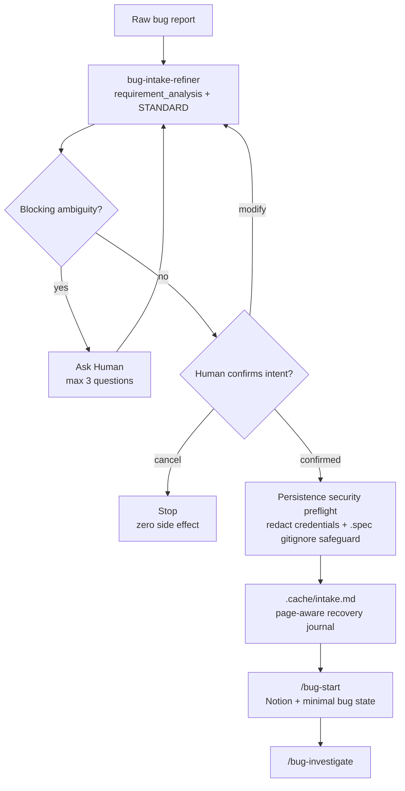
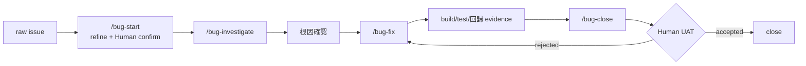

# Bug Workflow Plugin `v4.0.3`

跨 Host 的 Bug lifecycle：建立狀態、蒐集證據、驗證根因、修復、回歸測試，最後由 Human UAT 決定是否結案。核心流程依賴 CREW Host Capability Contract，而不是某一家的 agent/team 工具。

## 安裝

### Claude Code

```bash
claude plugin marketplace add mark22013333/crew
claude plugin install bug-workflow
```

### Codex

```bash
codex plugin marketplace add mark22013333/crew
codex plugin add bug-workflow@crew
```

首次使用可執行 `/bug-setup`，或由 `/crew-init` 統一引導。

## 更新

推薦：

```text
/crew-upgrade
/crew-upgrade --check
```

Claude Code 手動更新：

```bash
claude plugin marketplace update company-marketplace
claude plugin update bug-workflow@company-marketplace
claude plugin list
```

Codex 手動更新：

```bash
codex plugin marketplace upgrade crew
codex plugin list
```

更新後開新 session。若 Codex marketplace 尚未註冊，先執行 `codex plugin marketplace add mark22013333/crew`。

---

## Intake refinement

新的 Bug raw issue 會先經唯讀 `bug-intake-refiner`，再由 Human 明確確認；使用者不需要手動呼叫 Refiner，它不是 Slash Skill。

<!-- crew:diagram intake-refinement-flow -->

```mermaid
flowchart TD
    Raw["Raw bug report"] --> Refiner["bug-intake-refiner<br/>requirement_analysis + STANDARD"]
    Refiner --> Blocking{"Blocking ambiguity?"}
    Blocking -- "yes" --> Ask["Ask Human<br/>max 3 questions"]
    Ask --> Refiner
    Blocking -- "no" --> Confirm{"Human confirms intent?"}
    Confirm -- "modify" --> Refiner
    Confirm -- "cancel" --> Stop["Stop<br/>zero side effect"]
    Confirm -- "confirmed" --> Guard["Persistence security preflight<br/>redact credentials + .spec gitignore safeguard"]
    Guard --> Cache[".cache/intake.md<br/>page-aware recovery journal"]
    Cache --> Start["/bug-start<br/>Notion + minimal bug state"]
    Start --> Investigate["/bug-investigate"]
```

規則：

- `/bug-start <問題>` 自動使用 intake refinement；`/bug-investigate <新問題>` 會先進 `/bug-start`。
- 已存在的 Bug、`/bug-investigate --resume`、`/bug-update`、`/bug-fix`、`/bug-close` 不重新 refine。
- Host 支援 named sub-agent 時使用 `bug-intake-refiner`；不支援時 inline 執行同一 shared contract。
- Human confirmation 前禁止 Notion/state/`.spec` side effect。
- confirmation 後、持久化前做 credential preflight；疑似 secret 必須先由 Human 提供 redacted 版本。
- 在 Git repo 內寫 cache/state 前先確認 `.spec/` 已被 `.gitignore` 保護。
- cache 固定保存 original/refined/title 與 `notion_page_id`；Notion page create 後 page ID 先寫 cache，再進 state init，所以中斷重跑能沿用既有 page。
- Notion「🔴 問題描述」保存 `### 原始通報` + `### 確認後問題描述`。
- `/bug-investigate`、`/bug-update`、`/bug-close` 都執行 **Bug intake recovery preflight**：只補缺少內容、不覆蓋既有內容。
- cache 只有在重新 fetch 確認 intake headings + **五個標準 Bug sections**（調查過程／根因分析／修復方案／驗證／經驗教訓）全部存在後才刪除；若只有 headings 完整，仍必須補齊缺少 section，不得提前清 cache。
- `/bug-close` 先以 Notion page ID deterministic 綁定唯一 Bug state / slug，再進 UAT gate；找不到或多筆都 BLOCK。
- CREW scripts 一律先解析 `CREW_PLUGIN_ROOT`，不直接依賴 Claude marketplace path。

完整 contract 見 [references/intake-refinement.md](references/intake-refinement.md)。

---

## 核心流程

<!-- crew:diagram bug-lifecycle -->

```mermaid
flowchart LR
    A["raw issue"] --> S["/bug-start<br/>refine + Human confirm"]
    S --> B["/bug-investigate"]
    B --> C["根因確認"]
    C --> D["/bug-fix"]
    D --> E["build/test/回歸 evidence"]
    E --> F["/bug-close"]
    F --> G{"Human UAT"}
    G -- accepted --> H["close"]
    G -- rejected --> D
```

Runtime state：

```text
start → investigate → fix → close
```

`.spec/{slug}/state.json` 是唯一流程狀態，唯一寫者為 `scripts/crew-state.py`。調查與修復都使用 resumable work unit，因此 session 中斷後可從 deterministic state 繼續。

### Human UAT

`/bug-close` 不能把 build/test、C1-C4 或其他 machine evidence 自動等同「使用者接受修復」。只有 Human 明確接受後，才能寫入 `uat=approved` 並完成 close；若 rejected，下一步回到 `/bug-fix`。

---

## Model Routing

Bug workflow 使用 provider-neutral profiles：

| 工作 | Profile | 是否可改產品碼 |
|---|---|---|
| repository search、log/stacktrace/Git evidence 蒐集 | `FAST` | 否 |
| 一般假說推理、debugging | `STANDARD` | 否 |
| 複雜跨模組/交易/並行根因 | `DEEP` | 否 |
| build/test/schema validation | `NONE` | 否 |
| 已確認根因後的正式修復與迴歸測試 | `DEEP` | **是** |

實際 provider model 由 Host adapter 與 `crew-model-route.py` 決定。Host 無法精準套用 per-worker mapping 時，保留角色/write boundary 並標記 routing degraded；不可假裝已切換模型。

---

## Host Capability Contract

Bug Skill 只依賴 capability：

- `project_instructions`：接受 `AGENTS.md`、`CLAUDE.md`
- `delegate_readonly`：證據蒐集與分析
- `delegate_write`：只有 `/bug-fix` 可用於正式產品碼
- `parallel_delegate`：可用則平行，不可用就 sequential
- `tool_probe`：判斷 DB/外部工具真的能否呼叫
- `ask_user`：根因歧義與 UAT 等 Human decision

完整 contract 見 [references/host-capabilities.md](references/host-capabilities.md)。

---

## 首次設定與 Portable Config

`/bug-setup` 不再要求使用者選擇某個 Host-specific storage directory。CREW-owned config 透過 shared resolver 存取。

Portable root：

1. `CREW_CONFIG_HOME`
2. `$XDG_CONFIG_HOME/crew`
3. `~/.config/crew`

Bug 相關 logical keys：

| Key | 用途 |
|---|---|
| `bug/config` | Notion Data Source IDs、workspace/欄位 metadata |
| `bug/learning` | Bug learning storage |
| `feature/project` | 共用 repo-id → project mapping（由 `/project-add` 管理） |

實際 read fallback / canonical write path 由 `scripts/crew-config.py` 決定。Skill 不自行拼 Host path，也不把 project mapping 複寫回 Bug 主設定。

---

## 專案指令與專案註冊

需要專案規範時使用 `project_instructions`：

- `AGENTS.md`
- `CLAUDE.md`

兩者都存在時都可讀；有衝突就列為 ambiguity。

`/project-add` 會：

1. 解析 repo-id。
2. 同步/更新 Notion 專案。
3. 以 portable `feature/project` 寫入 project frontmatter（stack、prod branch、可選 uat branch）。
4. legacy monolith 僅相容讀取；更新時寫 canonical project file。

---

## 指令

| Skill | 說明 |
|---|---|
| `/bug-setup` | 建立/更新 Bug portable config |
| `/bug-start <問題>` | 自動 intake refine + Human confirm，再建立 Bug + minimal runtime state |
| `/bug-investigate` | 假說驅動調查；可 `--resume` |
| `/bug-update` | 補充調查資訊 / reopen |
| `/bug-fix` | 三段 resumable 修復 + 回歸驗證 |
| `/bug-close` | Human UAT、結案、知識同步與 merge 引導 |
| `/project-add` | 建立/更新 project mapping |
| `/crew-init` | setup / registration read-only 偵測與引導 |
| `/crew-doctor` | config/project/tool 健診；config storage 不由 doctor 直接 mkdir |
| `/crew-upgrade` | 更新 CREW plugins |

---

## SessionStart hook

Claude Code adapter 會執行 `python3 scripts/crew-state.py session-brief`：

- 只讀當前專案 `.spec/*/state.json`
- 不外送資料
- 不寫產品檔案
- 顯示未結案任務與建議下一步
- 失敗時不阻擋 session

其他 Host 沒有同等 session hook 也沒關係；直接使用 workflow Skill / state next 即可。

---

## 設計參考

- [Host Capability Contract](references/host-capabilities.md)
- [Model Policy](references/model-policy.md)
- [State Discipline](references/state-discipline.md)
- [Portable Config Contract](references/config-contract.md)
- [Learning Schema](references/learnings-schema.md)
- [Intake Refinement Contract](references/intake-refinement.md)

## 授權

MIT License
