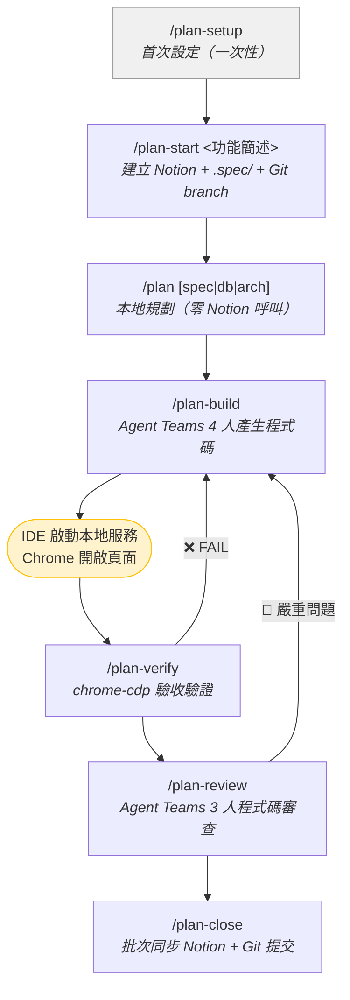
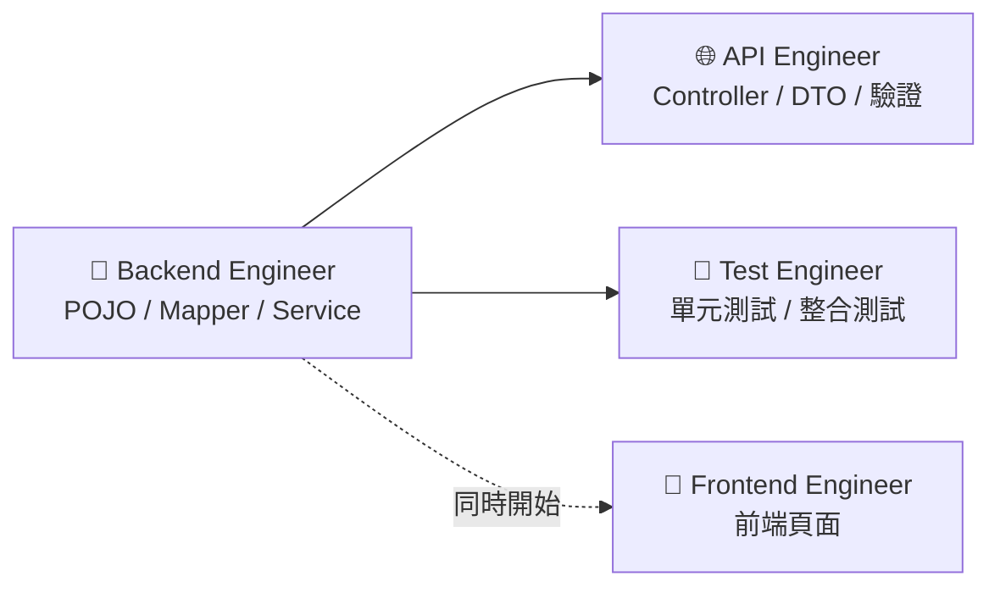
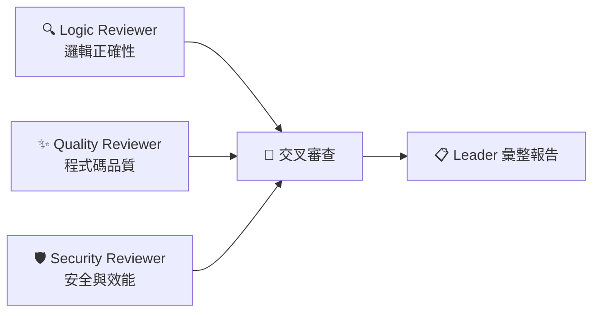

# Feature Workflow Plugin

功能開發工作流 — 整合 Notion 與 Claude Code，以 `.spec/` 目錄做本地規劃，Agent Teams 產生程式碼與審查，chrome-cdp 驗收驗證，結案時批次同步 Notion。

不綁定特定專案架構，所有 Skill 執行時讀取當前專案的 CLAUDE.md 動態適配。

## 安裝

```bash
claude plugin marketplace add mark22013333/crew && \
claude plugin install feature-workflow && \
claude plugin enable feature-workflow
```

首次使用前執行 `/plan-setup` 完成設定引導。

### 更新

```bash
claude plugin update feature-workflow@company-marketplace
```

更新完成後**重啟 Claude Code** 使新版生效。

---

## 流程



流程非強制線性，可跳過任何步驟、反覆執行。

---

## Skill 清單

| Skill | 說明 | Notion 呼叫 |
|-------|------|-------------|
| `/plan-setup` | 首次設定引導（Notion 偵測 + Agent 安裝） | 一次性 |
| `/plan-stack` | 偵測專案分層結構，建立自訂技術棧 | **0 次** |
| `/plan-start` | 建立任務到 .spec/ + Notion | **2-3 次** |
| `/plan` | 本地規劃（spec/db/arch） | **0 次** |
| `/plan-build` | Agent Teams 4 人產生程式碼 | **0 次** |
| `/plan-verify` | chrome-cdp 操作瀏覽器驗證驗收條件 | **0 次** |
| `/plan-review` | Agent Teams 3 人程式碼審查 | **0 次** |
| `/plan-close` | 批次同步 Notion + Git 提交 | **3-5 次** |
| `/plan-sync` | 手動中途同步 .spec/ 到 Notion | **2-3 次** |
| `/plan-status` | 查看任務狀態 | **0 次** |
| `/project-add` | 新增或更新專案對應（來自 bug-workflow） | 1-2 次 |

---

## 前置設定

### Agent Teams（plan-build / plan-review）

```json
// ~/.claude/settings.json
{
  "env": {
    "CLAUDE_CODE_EXPERIMENTAL_AGENT_TEAMS": "1"
  }
}
```

> tmux session 中自動啟用 Split Pane，只需 `tmux new-session -s dev` 後啟動 Claude Code。

### Chrome Remote Debugging（plan-verify）

`/plan-verify` 透過 Chrome DevTools Protocol 連接已開啟的 Chrome session，直接操作已登入的頁面驗證驗收條件。對需要 SSO/VPN 的內部系統特別有用。

| 項目 | 需求 |
|------|------|
| Node.js | **22 以上** |
| Chrome | 啟用 Remote Debugging |

**啟用方式**：Chrome 網址列輸入 `chrome://inspect/#remote-debugging`，開啟切換開關。也支援 Chromium、Brave、Edge、Vivaldi。

```bash
/plan-verify                    # 完整驗證所有驗收條件
/plan-verify --manual           # 互動模式，每步驟等待確認
/plan-verify <URL>              # 指定目標頁面
/plan-verify --api-only         # 只驗證 API（不需 Chrome）
/plan-verify --recheck          # 僅重新驗證上次失敗的項目
```

---

## Agent Teams 組成

### plan-build（4 人開發團隊）



### plan-review（3 人審查團隊）



三位 Reviewer 完成後互相分享發現，交叉審查後由 Leader 彙整報告。

---

## 技術棧支援

### 內建

| ID | 框架 | ORM |
|----|------|-----|
| `spring-mvc-mybatis` | Spring MVC 4.x | MyBatis + tk.mybatis |
| `spring-boot-mybatis` | Spring Boot 2.x+ | MyBatis + tk.mybatis |
| `spring-boot-jpa` | Spring Boot 2.x+ | JPA/Hibernate |
| `spring-boot-mybatis-plus` | Spring Boot 2.x+ | MyBatis-Plus |

### 自訂

執行 `/plan-stack` 自動掃描專案結構產生掃描規則。

---

## Agent 雙模式

| 模式 | 說明 |
|------|------|
| **SKILL.md 內嵌**（預設） | 安裝 Plugin 即可用 |
| **獨立 Agent 檔案** | `/plan-setup` 時可選安裝，可獨立使用 |

獨立 Agent：`spec-analyst`、`db-designer`、`backend-designer`、`code-generator`。

---

## 與 bug-workflow 的關係

- 共用 Notion「任務追蹤工具」和「專案資料庫」
- 共用 `/project-add` 管理專案對應
- 互不干擾，可同時使用

## 授權

MIT License
