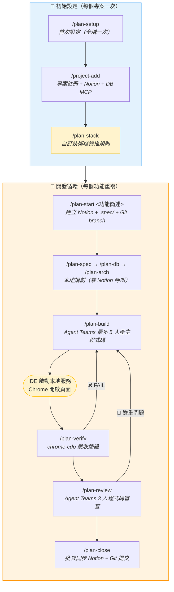
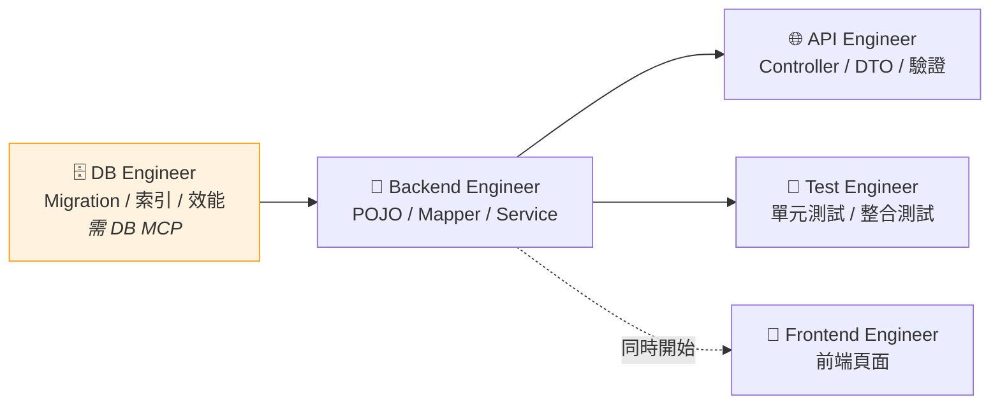
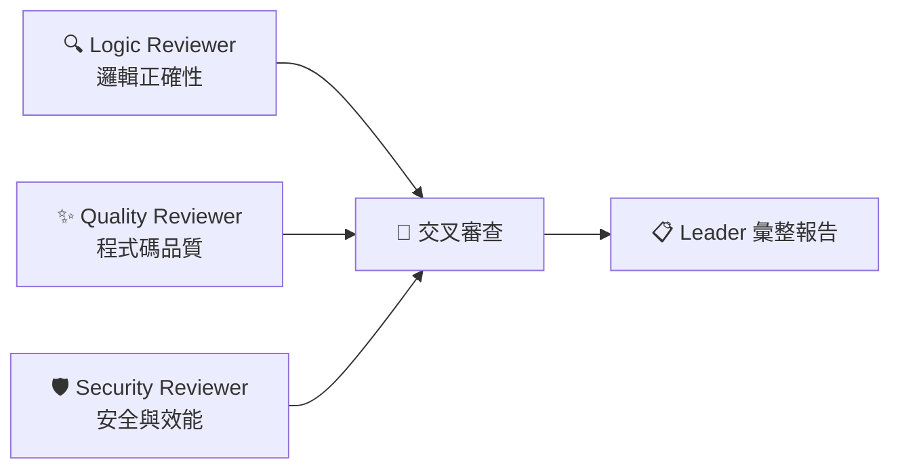

# Feature Workflow Plugin `v4.6.4`

功能開發工作流 — 整合 Notion 與 Claude Code，以 `.spec/` 目錄做本地規劃，Agent Teams 產生程式碼與審查，Chrome DevTools 驗收驗證，結案時批次同步 Notion。

不綁定特定專案架構，所有 Skill 執行時讀取當前專案的 CLAUDE.md 動態適配。

## 安裝

```bash
claude plugin marketplace add mark22013333/crew && \
claude plugin install feature-workflow
```

安裝後 Plugin 會自動啟用。若未自動啟用，手動執行：`claude plugin enable feature-workflow`

首次使用前執行 `/plan-setup` 完成設定引導。

### 更新

```bash
claude plugin update feature-workflow@company-marketplace
```

更新完成後**重啟 Claude Code** 使新版生效。

---

## 流程



> `/plan-stack` 為可選步驟 — 內建技術棧且分層結構標準時可跳過。
> 開發循環非強制線性，可跳過任何步驟、反覆執行。

---

## Skill 清單

| Skill | 說明 | Notion 呼叫 |
|-------|------|-------------|
| `/plan-setup` | 首次設定引導（Notion 偵測 + Agent 安裝） | 一次性 |
| `/plan-stack` | 偵測專案分層結構，建立自訂技術棧 | **0 次** |
| `/plan-start` | 建立任務到 .spec/ + Notion | **2-3 次** |
| `/plan` | 完整規劃串接（自動依序 spec→db→arch） | **0 次** |
| `/plan-spec` | 技術規格書 | **0 次** |
| `/plan-db` | 資料庫設計 | **0 次** |
| `/plan-arch` | 架構設計 | **0 次** |
| `/plan-build` | Agent Teams 最多 5 人產生程式碼（含 DB Engineer） | **0 次** |
| `/plan-verify` | chrome-devtools-mcp 或 cdp.mjs 操作瀏覽器驗證驗收條件 | **0 次** |
| `/plan-review` | Agent Teams 3 人程式碼審查 | **0 次** |
| `/plan-close` | 批次同步 Notion + Git 提交 | **3-5 次** |
| `/plan-sync` | 手動中途同步 .spec/ 到 Notion | **2-3 次** |
| `/plan-status` | 查看任務狀態 | **0 次** |
| `/project-add` | 新增或更新專案對應（來自 bug-workflow） | 1-2 次 |

---

## 前置設定

### plan-build 使用方式

```bash
/plan-build                # 完整產生（後端 + 前端 + API + 測試）
/plan-build --dry-run      # 預覽不建立檔案
/plan-build --backend-only # 只產後端
```

> 若專案已安裝 DB MCP（DBHub），Teammate 會自動查詢真實資料表結構來產生更準確的程式碼。

### Agent Teams（plan-build / plan-review）

```json
// ~/.claude/settings.json
{
  "env": {
    "CLAUDE_CODE_EXPERIMENTAL_AGENT_TEAMS": "1"
  }
}
```

> tmux session 中自動啟用 Split Pane，只需 `tmux new-session -s dev` 後啟動 Claude Code。

### plan-verify 前置條件

`/plan-verify` 透過 Chrome DevTools Protocol 連接已開啟的 Chrome session，直接操作已登入的頁面驗證驗收條件。對需要 SSO/VPN 的內部系統特別有用。

**方式 A：chrome-devtools-mcp（推薦）**

```bash
claude mcp add chrome-devtools --scope user -- \
  npx chrome-devtools-mcp@latest --autoConnect
```

Google 官方維護，29 種工具，安裝後重啟 Claude Code。需 Chrome 144+。

**方式 B：cdp.mjs（內建 fallback）**

- Node.js 22+
- 無需額外安裝，Plugin 內建

兩種方式都需要 Chrome 啟用 Remote Debugging：
Chrome 網址列 → `chrome://inspect/#remote-debugging` → 開啟切換開關。
也支援 Chromium、Brave、Edge、Vivaldi。

```bash
/plan-verify                    # 完整驗證（自動偵測 MCP 或 cdp.mjs）
/plan-verify --manual           # 互動模式，每步驟等待確認
/plan-verify <URL>              # 指定目標頁面
/plan-verify --api-only         # 只驗證 API（不需 Chrome）
/plan-verify --recheck          # 僅重新驗證上次失敗的項目
```

---

## Agent Teams 組成

### plan-build（最多 5 人開發團隊）



> DB Engineer 僅在專案安裝了 DB MCP（DBHub）時加入，透過 `execute_sql` 和 `search_objects` 直接查詢真實資料庫。

### plan-review（3 人審查團隊）



三位 Reviewer 完成後互相分享發現，交叉審查後由 Leader 彙整報告。

---

## 技術棧支援

### 內建

| ID | 框架 | ORM |
|----|------|-----|
| `spring-mvc-mybatis` | Spring MVC 4.x | MyBatis + tk.mybatis |
| `spring-boot-mybatis` | Spring Boot 2.x+ | MyBatis + tk.mybatis |
| `spring-boot-jpa` | Spring Boot 2.x+ | JPA/Hibernate |
| `spring-boot-mybatis-plus` | Spring Boot 2.x+ | MyBatis-Plus |

### 自訂

執行 `/plan-stack` 自動掃描專案的 `src/main/java` 目錄，辨識各層級 package 命名慣例，產生掃描規則寫入 `stacks/{id}.md`。

```
/plan-stack                    # 自動偵測後引導設定
/plan-stack my-custom-stack    # 直接指定技術棧 ID
```

**何時需要？**
- 內建四種技術棧覆蓋不了的框架組合
- 專案有非標準分層（如額外的 DB Service、UI Service 層）
- 需要精確控制 `/plan-build` 的程式碼範本掃描範圍

---

## Agent 雙模式

| 模式 | 說明 |
|------|------|
| **SKILL.md 內嵌**（預設） | 安裝 Plugin 即可用 |
| **獨立 Agent 檔案** | `/plan-setup` 時可選安裝，可獨立使用 |

獨立 Agent：`spec-analyst`、`db-designer`、`backend-designer`、`code-generator`。

---

## 設定目錄

採階層式目錄結構，技術棧和專案各自獨立檔案，避免單一設定檔膨脹：

```
~/.claude-company/feature-workflow/
├── config.md              # Notion IDs、工作區、欄位對照（固定，不膨脹）
├── stacks/                # 技術棧定義
│   ├── _builtin.md        # 內建技術棧總表
│   └── spring-mvc-jpa.md  # 自訂技術棧（/plan-stack 產生）
└── projects/              # 專案對應（/project-add 產生）
    ├── FUB02P2101--LineBC.md
    └── FUB03P2402--PushAPIService.md
```

Skill 按需載入 — 只讀取當前專案需要的層級，不載入全部。詳見 `references/config-resolver.md`。

---

## 與 bug-workflow 的關係

- 共用 Notion「任務追蹤工具」和「專案資料庫」
- 共用 `/project-add` 管理專案對應
- 互不干擾，可同時使用

## 授權

MIT License
