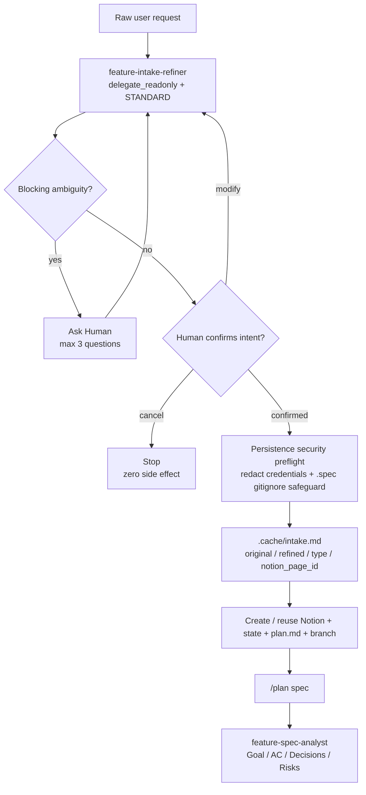
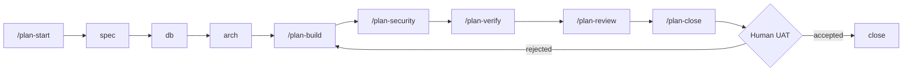
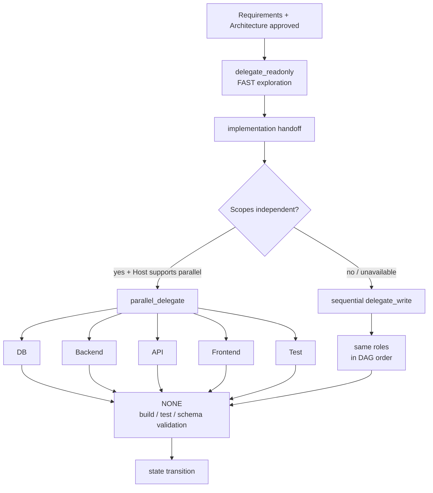
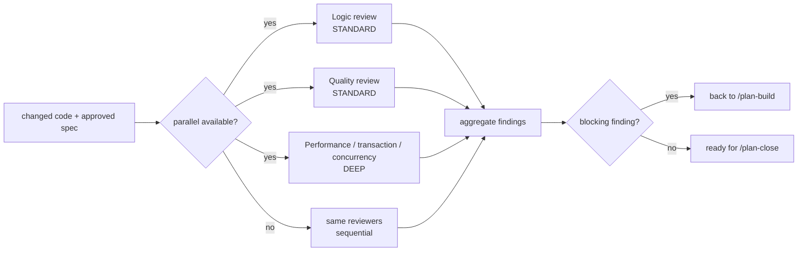
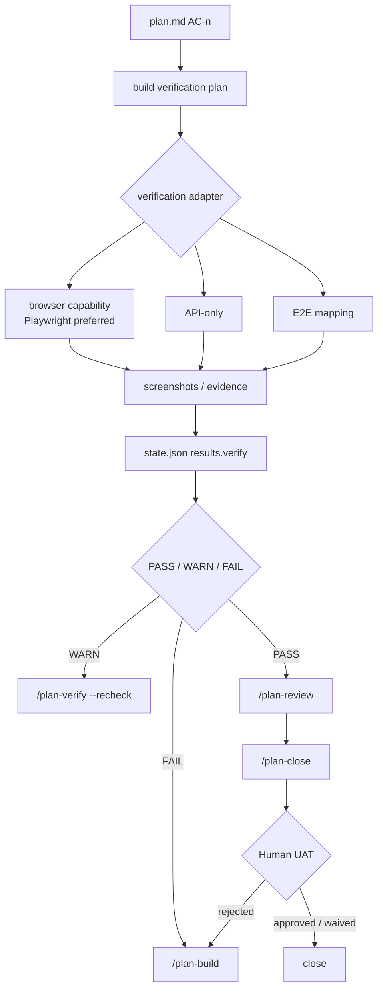

# Feature Workflow Plugin `v5.0.5`

跨 Host 的 Feature lifecycle：本地 `.spec/` 規劃、Human approval gates、正式實作、安全/驗證/review、Human UAT 與結案同步。核心 contract 不依賴單一 Host 的 team、subagent 或 provider model 名稱。

## 安裝

### Claude Code

```bash
claude plugin marketplace add mark22013333/crew
claude plugin install feature-workflow
```

### Codex

```bash
codex plugin marketplace add mark22013333/crew
codex plugin add feature-workflow@crew
```

首次使用執行 `/plan-setup`；若 Bug workflow 也安裝，建議先跑 `/bug-setup`，Feature setup 可重用共用 Notion metadata。

## 更新

若同時安裝 `bug-workflow`，可直接用統一入口：

```text
/crew-upgrade
/crew-upgrade --check
```

若只安裝 Feature plugin，使用 Host-native 更新：

### Claude Code

```bash
claude plugin marketplace update company-marketplace
claude plugin update feature-workflow@company-marketplace
claude plugin list
```

### Codex

```bash
codex plugin marketplace upgrade crew
codex plugin list
```

更新後開新 session。若 Codex marketplace 尚未註冊，先執行 `codex plugin marketplace add mark22013333/crew`。

---

## Intake refinement

`/plan-start` 在任何 Notion / `.spec` / Git side effect 前，先用唯讀 `feature-intake-refiner` 把 raw request 整理成短標題與 task brief，再由 Human 明確確認。Bug plugin 也依同一 shared contract 使用 `bug-intake-refiner`；兩者都不是 Slash Skill。

<!-- crew:diagram intake-refinement-flow -->

```mermaid
flowchart TD
    Raw["Raw user request"] --> Refiner["feature-intake-refiner<br/>delegate_readonly + STANDARD"]
    Refiner --> Blocking{"Blocking ambiguity?"}
    Blocking -- "yes" --> Ask["Ask Human<br/>max 3 questions"]
    Ask --> Refiner
    Blocking -- "no" --> Confirm{"Human confirms intent?"}
    Confirm -- "modify" --> Refiner
    Confirm -- "cancel" --> Stop["Stop<br/>zero side effect"]
    Confirm -- "confirmed" --> Guard["Persistence security preflight<br/>redact credentials + .spec gitignore safeguard"]
    Guard --> Cache[".cache/intake.md<br/>original / refined / type / notion_page_id"]
    Cache --> Start["Create / reuse Notion + state + plan.md + branch"]
    Start --> Spec["/plan spec"]
    Spec --> Analyst["feature-spec-analyst<br/>Goal / AC / Decisions / Risks"]
```

責任分界與 durability：

- Intake Refiner：回答「使用者到底想做什麼？」；不產 AC、不做 DB/API/架構設計。
- Human：確認 refined intent；沉默不算核准。
- persistence 前若疑似含 credential，先要求 Human 提供 redacted 版本；不把 secret 寫進 cache / Notion / plan.md / state。
- Git repo 內建立 cache/state 前先確認 `.spec/` 已被 `.gitignore` 保護。
- `feature-spec-analyst`：task 建立後才把 confirmed brief 工程化成 Goal / AC / Decisions / Risks。
- Notion「📋 需求描述」永久保存 raw original + confirmed refined brief；plan.md 只保留 refined brief。
- Plan intake cache 是 page-aware recovery journal，保存 `notion_page_id`；Notion create 成功後先 journal page ID，再 init state。
- 重跑遇到 matching pending task 會先詢問是否沿用；cache 有 page ID 時 fetch/沿用，不建立 duplicate page。
- `/plan-sync` 會 reconcile cache/page/state 後補建/補寫；只有 state/page/intake 全部一致才刪 cache。`/plan-close` 發現 cache/state page ID 衝突會 BLOCK。
- `/plan-start`、`/plan-sync`、`/plan-close` 呼叫 CREW scripts 時都先解析 `CREW_PLUGIN_ROOT`；不直接依賴 Claude marketplace/cache path。
- Shared intake contract 同時定義 Bug durable recovery；Bug cache 必須在 intake headings + 五個標準 Bug sections 全部 fetch 驗證完成後才可刪除，只有 headings 完整仍不夠。Feature plugin 保留同步副本是為了兩個 plugin 都可獨立安裝且 contract 不漂移。

完整 contract 見 [references/intake-refinement.md](references/intake-refinement.md)。

---

## Feature lifecycle

<!-- crew:diagram feature-lifecycle -->

```mermaid
flowchart LR
    A["/plan-start"] --> B["spec"]
    B --> C["db"]
    C --> D["arch"]
    D --> E["/plan-build"]
    E --> F["/plan-security"]
    F --> G["/plan-verify"]
    G --> H["/plan-review"]
    H --> I["/plan-close"]
    I --> J{"Human UAT"}
    J -- accepted --> K["close"]
    J -- rejected --> E
```

Runtime steps：

```text
start → spec → db → arch → build → security → verify → review → close
```

`.spec/{slug}/state.json` 是唯一流程狀態，唯一寫者為 `scripts/crew-state.py`。

### Approval gates

- Requirements 未核准：不得往 DB/arch/build。
- Architecture 未核准：不得進 build。
- `verify=PASS` 或 review 完成：**不等於 Human UAT approved**。
- `/plan-close` 是 Feature UAT + close 的合法入口；每次結案前都重新取得本輪 Human decision。

---

## `.spec/` 結構

v2 task 的核心檔案：

```text
.spec/{slug}/
├── plan.md       # goal / AC / decisions / risks / map / report anchors
├── state.json    # machine state；唯一寫者 crew-state.py
└── deploy.sql    # 有 DB migration 時才存在
```

`files.md`、`log.md`、`handoff.md`、`.spec/_index.md` 等 v1 artifact 不再是 v2 runtime contract。Notion intake 尚未成功持久化時可暫存 `.spec/{slug}/.cache/intake.md`；它 gitignored、同步成功後刪除，不是永久 runtime artifact。

---

## Host Capability Contract

Feature workflow 用 capability 描述角色，不要求某個 Host 一定有 team/multi-agent：

| Capability | 用途 | 無該 Host 能力時 |
|---|---|---|
| `project_instructions` | 讀 `AGENTS.md` / `CLAUDE.md` | 無任何指令檔才阻擋 |
| `delegate_readonly` | spec、探索、review | 主 Agent inline 唯讀執行 |
| `delegate_write` | 已核准的正式實作 | 主 Agent 按 allowed scope 寫入 |
| `parallel_delegate` | 互不依賴角色加速 | sequential fallback |
| `tool_probe` | DB/瀏覽器等外部能力 | no-tool fallback |
| `ask_user` | requirements / architecture / UAT decision | 一般對話詢問 |

因此平行執行是最佳化，不是 `/plan-build` 或 `/plan-review` 的 hard prerequisite。

完整 contract 見 [references/host-capabilities.md](references/host-capabilities.md)。

---

## Model Routing

Feature workflow 使用 provider-neutral profiles：

| 工作 | Profile | 可改產品碼 |
|---|---|---|
| repository search、範本/交叉引用探索 | `FAST` | 否 |
| 一般需求分析與一般 review | `STANDARD` | 否 |
| DB schema / architecture / security / performance | `DEEP` | 否 |
| build/test/schema validation | `NONE` | 否 |
| `/plan-build` 正式實作 | `DEEP`（目前保守基準） | **是** |

Profile 由 `crew-model-route.py` + `model-routing.json` 計算，Host adapter 才決定實際 provider mapping。Workflow README 不把 provider model 名稱當成流程契約。

---

## Portable Config

CREW-owned Feature config 由 shared resolver 管理，不由 README 指定 Host-specific directory。

Portable root：

1. `CREW_CONFIG_HOME`
2. `$XDG_CONFIG_HOME/crew`
3. `~/.config/crew`

主要 logical keys：

| Key | 用途 |
|---|---|
| `feature/config` | Notion IDs、workspace metadata、欄位對照 |
| `feature/project` | repo-id 專案對應 |
| `feature/stack` | 自訂 stack definition |
| `bug/config` | setup 時可讀取共用 Notion metadata |

`scripts/crew-config.py` 負責 canonical path、legacy read fallback 與 representation；新寫入永遠走 portable root。Feature project / stack 的 standalone file 依 logical key 解析，不直接硬編碼某個 Host home path。

---

## 專案指令

需要專案架構與規範時使用 `project_instructions`：

- `AGENTS.md`
- `CLAUDE.md`

兩者並存時都可讀；若內容衝突，必須保留歧義讓 Human 決定。

---

## Skill 清單

| Skill | 說明 |
|---|---|
| `/plan-setup` | 建立/更新 Feature portable config |
| `/plan-stack` | 掃描專案並建立自訂 stack definition |
| `/plan-start <任務>` | Refine raw request → Human confirm → 建立 Notion + `.spec/` + Git branch |
| `/plan-explore` | 想法探索、問題調查、方案比較 |
| `/plan-browse` | 深讀/比較既有規劃 |
| `/plan [spec\|db\|arch]` | 三 pass 規劃與 approval loop |
| `/plan-build` | 依核准規格執行正式實作；支援 dry-run / scoped build |
| `/plan-security` | 安全審查 |
| `/plan-verify` | Browser/API 驗證、evidence、Word/Excel/E2E 選項 |
| `/plan-review` | 邏輯、品質、效能 review；可 quick |
| `/plan-close` | Human UAT + 結案同步 |
| `/plan-sync` | 中途同步 `.spec/` 到 Notion |
| `/plan-deploy-confirm` | 部署 SQL step 回報 |
| `/plan-status` | 查看任務狀態；v1 可 migrate |
| `/plan-next` | 從 state 計算下一步 |
| `/plan-drift` | `plan.md` anchor / code drift 檢查 |
| `/plan-demo` | 純本地評估模式 |

---

## `/plan-build` 執行模型

`/plan-build` 仍採「先探索、再按角色實作」的分工，但角色是 capability contract，不是某一種 Host team API：

<!-- crew:diagram plan-build-orchestration -->

```mermaid
flowchart TD
    Approved["Requirements + Architecture approved"] --> Explore["delegate_readonly<br/>FAST exploration"]
    Explore --> Handoff["implementation handoff"]
    Handoff --> Split{"Scopes independent?"}

    Split -- "yes + Host supports parallel" --> Parallel["parallel_delegate"]
    Split -- "no / unavailable" --> Sequential["sequential delegate_write"]

    Parallel --> DB["DB"]
    Parallel --> Backend["Backend"]
    Parallel --> API["API"]
    Parallel --> Frontend["Frontend"]
    Parallel --> Test["Test"]

    Sequential --> Roles["same roles<br/>in DAG order"]

    DB --> Proof["NONE<br/>build / test / schema validation"]
    Backend --> Proof
    API --> Proof
    Frontend --> Proof
    Test --> Proof
    Roles --> Proof
    Proof --> State["state transition"]
```

1. 唯讀探索：找相關檔案、現有範本、介面與影響範圍。
2. 將核准 spec + 探索 handoff 拆成 DB/backend/API/frontend/test 等必要角色。
3. Host 能平行且 scope 互斥時可 parallel delegate。
4. Host 無平行能力時依 DAG sequential 執行。
5. 每個可寫角色都限制 allowed paths；完成後跑 deterministic build/test。
6. 不允許因為 Host 能力較少而跳過 approval、scope 或 verification。

---

## `/plan-review` 執行模型

Review 以邏輯、品質、效能/交易/並行等角度拆開：

<!-- crew:diagram plan-review-orchestration -->

```mermaid
flowchart LR
    Input["changed code + approved spec"] --> Dispatch{"parallel available?"}
    Dispatch -- "yes" --> Logic["Logic review<br/>STANDARD"]
    Dispatch -- "yes" --> Quality["Quality review<br/>STANDARD"]
    Dispatch -- "yes" --> Performance["Performance / transaction / concurrency<br/>DEEP"]
    Dispatch -- "no" --> Sequential["same reviewers<br/>sequential"]

    Logic --> Aggregate["aggregate findings"]
    Quality --> Aggregate
    Performance --> Aggregate
    Sequential --> Aggregate
    Aggregate --> Result{"blocking finding?"}
    Result -- "yes" --> Build["back to /plan-build"]
    Result -- "no" --> Close["ready for /plan-close"]
```

- 各 reviewer 預設唯讀。
- 可平行時平行，不可平行時 sequential。
- 安全審查由 `/plan-security` 負責，不與一般 review 混為同一 gate。
- 小變更可使用 `/plan-review --quick`。

---

## `/plan-verify`

`/plan-verify` 產出 machine/browser evidence，而不是 Human UAT 本身。

<!-- crew:diagram plan-verify-flow -->

```mermaid
flowchart TD
    AC["plan.md AC-n"] --> Plan["build verification plan"]
    Plan --> Adapter{"verification adapter"}
    Adapter --> Browser["browser capability<br/>Playwright preferred"]
    Adapter --> API["API-only"]
    Adapter --> E2E["E2E mapping"]
    Browser --> Evidence["screenshots / evidence"]
    API --> Evidence
    E2E --> Evidence
    Evidence --> Result["state.json results.verify"]
    Result --> Status{"PASS / WARN / FAIL"}
    Status -- "FAIL" --> Build["/plan-build"]
    Status -- "WARN" --> Recheck["/plan-verify --recheck"]
    Status -- "PASS" --> Review["/plan-review"]
    Review --> Close["/plan-close"]
    Close --> UAT{"Human UAT"}
    UAT -- "rejected" --> Build
    UAT -- "approved / waived" --> Done["close"]
```

可依環境使用：

- Browser 驗收（Playwright preferred；chrome-devtools / local CDP fallback）
- API-only
- recheck
- Excel report
- Word report
- E2E runner

外部 browser/DB 工具以 `tool_probe` 判斷目前 Host 是否真的可呼叫；不能用某一家 CLI listing 代替 capability probe。

Project verify memory canonical storage 是 `.crew/verify-memory.md`；舊 `.claude/verify-memory.md` 只在 canonical 不存在時相容讀取。驗證結果仍以 `state.json.results.verify` 為唯一 machine truth。

流程邊界：`verify PASS` → `/plan-review` → `/plan-close`；**Human UAT 在 `/plan-close` 內取得**，不是 `/plan-verify` 的副作用。

---

## SessionStart hook

Claude Code adapter 會以 `crew-state.py session-brief` 顯示未完成任務與 `/plan-next`。Hook 只讀當前 repo 的 state，不外送、不修改產品檔案，錯誤時不阻擋 session。

沒有同等 session hook 的 Host 直接使用 `/plan-next` 即可，不影響 workflow correctness。

---

## v1 compatibility

v1 任務目前仍可相容完成或用 `/plan-status --migrate <slug>` 做機械遷移。

Removal eligibility：

- `feature-workflow@5.1.0+` 發布；或
- `2026-10-26`

以先到者為準。門檻未達前不得提前刪 v1 compatibility surface。

詳見 [references/legacy-v1.md](references/legacy-v1.md)。

---

## 與 Bug Workflow 的關係

- 共用 Notion 任務/專案 metadata。
- `/project-add` 維護 shared `feature/project` mapping。
- 共用 Host Capability、Model Policy、State Discipline、Portable Config Contract。
- Bug 與 Feature lifecycle 各自 type-aware，不用 Feature phases 模擬 Bug。

## 設計參考

- [Host Capability Contract](references/host-capabilities.md)
- [Model Policy](references/model-policy.md)
- [State Discipline](references/state-discipline.md)
- [Portable Config Contract](references/config-contract.md)
- [Config Resolver](references/config-resolver.md)
- [UAT Gate](references/uat-gate.md)
- [Verify Memory Contract](references/verify-memory.md)
- [Intake Refinement Contract](references/intake-refinement.md)

## 授權

MIT License
